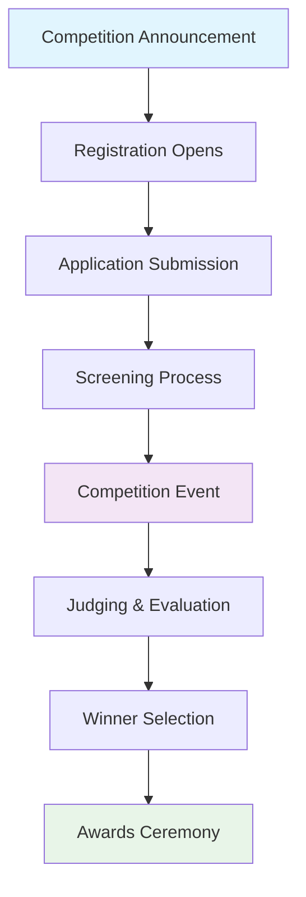
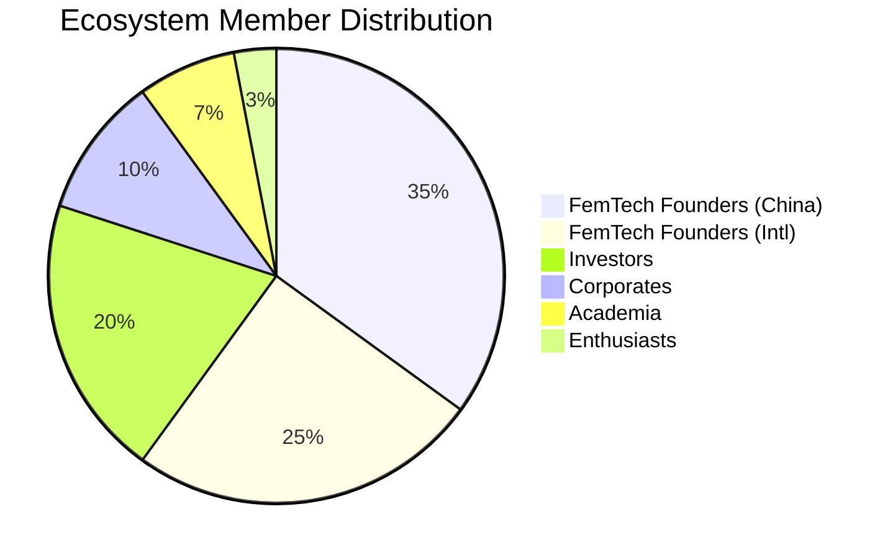
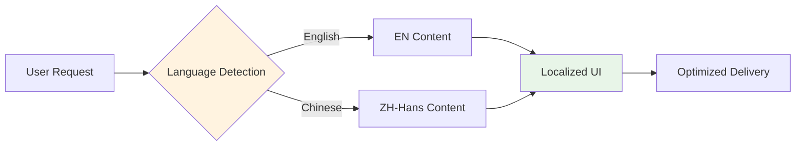
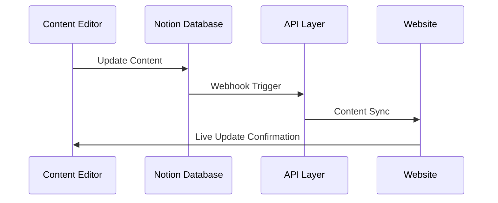

<div align="center"><a name="readme-top"></a>

[![][image-banner]][vercel-link]

# FemTech Weekend

An open-source, modern-design platform for women's health innovation.<br/>
Supports bilingual content, ecosystem management, and extensible form submission system.<br/>
One-click **FREE** deployment of your private FemTech community platform.

**English** · [简体中文](./README.zh-CN.md) · [Official Site][official-site] · [Changelog][changelog] · [Documents][docs] · [Competition][competition] · [Ecosystem][ecosystem]

<!-- SHIELD GROUP -->

[![][github-release-shield]][github-release-link]
[![][vercel-shield]][vercel-link]
[![][github-action-test-shield]][github-action-test-link]
[![][github-contributors-shield]][github-contributors-link]<br/>
[![][github-forks-shield]][github-forks-link]
[![][github-stars-shield]][github-stars-link]
[![][github-issues-shield]][github-issues-link]
[![][github-license-shield]][github-license-link]<br/>
[![][docusaurus-shield]][docusaurus-link]
[![][typescript-shield]][typescript-link]
[![][tailwind-shield]][tailwind-link]
[![][notion-shield]][notion-link]

**Share FemTech Weekend Repository**

[![][share-x-shield]][share-x-link]
[![][share-linkedin-shield]][share-linkedin-link]
[![][share-reddit-shield]][share-reddit-link]
[![][share-weibo-shield]][share-weibo-link]

<sup>Pioneering women's health innovation. Rooted in China, Connecting globally.</sup>

[![][github-trending-shield]][github-trending-url]

![][image-overview]

</div>

<details>
<summary><kbd>Table of contents</kbd></summary>

#### TOC

- [FemTech Weekend](#femtech-weekend)
      - [TOC](#toc)
      - [](#)
  - [👋🏻 Getting Started \& Join Our Community](#-getting-started--join-our-community)
  - [✨ Features](#-features)
    - [`1` Competition Management Platform](#1-competition-management-platform)
    - [`2` Ecosystem Directory](#2-ecosystem-directory)
    - [`3` Research Reports Hub](#3-research-reports-hub)
    - [`4` Bilingual Content Support](#4-bilingual-content-support)
    - [`5` Interactive Form System](#5-interactive-form-system)
    - [`6` PDF Download Management](#6-pdf-download-management)
    - [`7` Notion CMS Integration](#7-notion-cms-integration)
    - [`8` Image Upload \& Optimization](#8-image-upload--optimization)
    - [`9` Progressive Web App (PWA)](#9-progressive-web-app-pwa)
    - [`10` Modern UI/UX Design](#10-modern-uiux-design)
    - [`11` SEO \& Search Optimization](#11-seo--search-optimization)
    - [`12` Mobile-First Responsive Design](#12-mobile-first-responsive-design)
    - [`*` What's more](#-whats-more)
  - [⚡️ Performance](#️-performance)
  - [🛳 Self Hosting](#-self-hosting)
    - [`A` Deploying with Vercel](#a-deploying-with-vercel)
      - [After Fork](#after-fork)
      - [Keep Updated](#keep-updated)
    - [`B` Deploying with Docker](#b-deploying-with-docker)
    - [Environment Variables](#environment-variables)
  - [📦 Ecosystem](#-ecosystem)
  - [🧩 API Routes](#-api-routes)
  - [⌨️ Local Development](#️-local-development)
  - [🤝 Contributing](#-contributing)
  - [❤️ Sponsor](#️-sponsor)
  - [🔗 More Products](#-more-products)

####

<br/>

</details>

## 👋🏻 Getting Started & Join Our Community

We are a group of passionate innovators, dedicated to advancing women's health technology and creating a global community that bridges China with the world. By adopting modern web technologies, we aim to provide developers and organizations with an open, transparent, and user-friendly platform ecosystem.

Whether for users or professional developers, FemTech Weekend will be your innovation playground. Please be aware that the platform is currently under active development, and feedback is welcome for any [issues][issues-link] encountered.

| [![][vercel-shield-badge]][vercel-link]   | No installation or registration necessary! Visit our website to experience it firsthand.                                     |
| :---------------------------------------- | :---------------------------------------------------------------------------------------------------------------------------- |
| [![][ecosystem-shield-badge]][ecosystem-link] | Join our ecosystem! This is where you can connect with entrepreneurs, investors, and other enthusiastic innovators. |

> \[!IMPORTANT]
>
> **Star Us**, You will receive all release notifications from GitHub without any delay \~ ⭐️

[![][image-star]][github-stars-link]

<details>
  <summary><kbd>Star History</kbd></summary>
  <picture>
    <source media="(prefers-color-scheme: dark)" srcset="https://api.star-history.com/svg?repos=ChanMeng666%2Ffemtech-weekend-website&theme=dark&type=Date">
    
  </picture>
</details>

## ✨ Features

### `1` Competition Management Platform

Experience comprehensive competition management with our innovative platform. The system provides end-to-end solutions for hosting FemTech competitions, from registration to winner announcements.

Key capabilities include:
- **Registration Management**: Streamlined application process with form validation
- **Timeline Tracking**: Visual progress indicators for competition phases
- **Submission Portal**: Secure file upload and project submission system
- **Judging Interface**: Structured evaluation tools for competition judges



[![][back-to-top]](#readme-top)

### `2` Ecosystem Directory

Introducing a comprehensive ecosystem directory that showcases 200+ members across the FemTech landscape. Our directory provides a dynamic, searchable platform for discovering key players in women's health innovation.

Member categories include:
- **FemTech Founders (Mainland China)**: Local innovators driving change
- **FemTech Founders (International)**: Global thought leaders and entrepreneurs
- **Investors**: VCs and angels focused on women's health
- **Corporates**: Enterprise partners and strategic allies
- **Academia**: Researchers and academic institutions
- **FemTech Enthusiasts**: Community advocates and supporters



[![][back-to-top]](#readme-top)

### `3` Research Reports Hub

Access cutting-edge research and insights through our comprehensive reports hub. The platform aggregates the latest FemTech market intelligence, trend analysis, and industry reports.

Report categories:
- **Market Analysis**: Industry trends and market sizing
- **Technology Deep Dives**: Emerging technologies in women's health
- **Investment Reports**: Funding landscape and investor insights
- **Regional Studies**: Geographic market analysis
- **Case Studies**: Success stories and learnings

[![][back-to-top]](#readme-top)

### `4` Bilingual Content Support

Experience seamless bilingual functionality with our advanced internationalization system. The platform automatically adapts content, navigation, and user interfaces for both English and Chinese audiences.

Technical implementation:
- **Dynamic Language Switching**: Real-time content adaptation
- **Cultural Localization**: Region-specific content variations
- **SEO Optimization**: Language-specific search optimization
- **User Preference Memory**: Automatic language detection and retention



[![][back-to-top]](#readme-top)

### `5` Interactive Form System

Leverage our sophisticated form management system that seamlessly integrates with Notion databases for data collection and management.

Form capabilities:
- **Multi-step Forms**: Progressive data collection with validation
- **File Upload Support**: Image and document handling via Cloudinary
- **Real-time Validation**: Instant feedback and error handling
- **Automated Workflows**: Integration with Notion for data processing

[![][back-to-top]](#readme-top)

### `6` PDF Download Management

Implement intelligent PDF download tracking with our innovative form-first approach. Users provide contact information before accessing valuable research reports and resources.

Features include:
- **Gated Content**: Strategic lead generation through content access
- **Download Analytics**: Comprehensive tracking and reporting
- **User Segmentation**: Automated categorization based on interests
- **Follow-up Automation**: Email sequences for downloaded content

[![][back-to-top]](#readme-top)

### `7` Notion CMS Integration

Experience seamless content management through our Notion CMS integration. Content creators can update website information directly through familiar Notion interfaces.

Integration benefits:
- **Real-time Sync**: Instant content updates without code deployment
- **Collaborative Editing**: Team-based content creation and review
- **Version Control**: Built-in revision history and rollback capabilities
- **Rich Media Support**: Images, videos, and embedded content



[![][back-to-top]](#readme-top)

### `8` Image Upload & Optimization

Cloudinary integration provides enterprise-grade image handling with automatic optimization, format conversion, and CDN delivery.

Optimization features:
- **Automatic Compression**: Smart quality adjustment
- **Format Detection**: WebP, AVIF, and format selection
- **Responsive Images**: Device-specific image sizing
- **CDN Delivery**: Global edge network distribution

[![][back-to-top]](#readme-top)

### `9` Progressive Web App (PWA)

We deeply understand the importance of providing a seamless experience for users in today's multi-device environment. Therefore, we have adopted Progressive Web Application ([PWA](https://support.google.com/chrome/answer/9658361)) technology, a modern web technology that elevates web applications to an experience close to that of native apps.

Through PWA, FemTech Weekend can offer a highly optimized user experience on both desktop and mobile devices while maintaining its lightweight and high-performance characteristics.

> \[!NOTE]
>
> If you are unfamiliar with the installation process of PWA, you can add FemTech Weekend as your desktop application by following these steps:
>
> - Launch the Chrome or Edge browser on your computer.
> - Visit the FemTech Weekend webpage.
> - In the upper right corner of the address bar, click on the <kbd>Install</kbd> icon.
> - Follow the instructions on the screen to complete the PWA Installation.

[![][back-to-top]](#readme-top)

### `10` Modern UI/UX Design

Built with cutting-edge design principles and modern frameworks to deliver exceptional user experiences across all devices and platforms.

Design highlights:
- **Component-Based Architecture**: Reusable UI components with TypeScript
- **Design System**: Consistent visual language with TailwindCSS
- **Accessibility First**: WCAG 2.1 AA compliance throughout
- **Animation & Interactions**: Smooth transitions and micro-interactions

[![][back-to-top]](#readme-top)

### `11` SEO & Search Optimization

Comprehensive SEO optimization with Algolia search integration ensures maximum discoverability and user engagement.

SEO features:
- **Meta Optimization**: Dynamic meta tags and structured data
- **Sitemap Generation**: Automatic XML sitemap creation
- **Search Integration**: Powerful Algolia-powered site search
- **Performance Optimization**: Core Web Vitals optimization

[![][back-to-top]](#readme-top)

### `12` Mobile-First Responsive Design

We have carried out extensive optimization for mobile devices to enhance the user's mobile experience. Our responsive design ensures perfect functionality across all screen sizes and devices.

Mobile optimizations:
- **Touch-Friendly Interface**: Optimized tap targets and gestures
- **Performance Optimization**: Lazy loading and image optimization
- **Offline Capabilities**: Service worker implementation
- **Cross-Platform Compatibility**: Consistent experience across platforms

[![][back-to-top]](#readme-top)

### `*` What's more

Besides these features, FemTech Weekend also has much better basic techniques underground:

- [x] 💨 **Quick Deployment**: Using Vercel platform, you can deploy with just one click and complete the process within 1 minute without any complex configuration.
- [x] 🌐 **Custom Domain**: If users have their own domain, they can bind it to the platform for quick access from anywhere.
- [x] 🔒 **Privacy Protection**: All sensitive data is properly handled with security best practices.
- [x] 💎 **Exquisite UI Design**: With a carefully designed interface, it offers an elegant appearance and smooth interaction. It supports light and dark themes and is mobile-friendly.
- [x] 🗣️ **Smooth User Experience**: Fluid responses ensure a smooth browsing experience with optimized loading times.
- [x] 📊 **Analytics Integration**: Comprehensive tracking and analytics for user behavior and content performance.

> ✨ More features will be added as FemTech Weekend evolves.

---

> \[!NOTE]
>
> You can find our upcoming [Roadmap][github-project-link] plans in the Projects section.

<div align="right">

[![][back-to-top]](#readme-top)

</div>

## ⚡️ Performance

> \[!NOTE]
>
> The complete list of reports can be found in the [📘 Lighthouse Reports][docs-lighthouse]

|                   Desktop                   |                   Mobile                   |
| :-----------------------------------------: | :----------------------------------------: |
|              ![][perf-desktop]              |              ![][perf-mobile]              |
| [📑 Lighthouse Report][perf-desktop-report] | [📑 Lighthouse Report][perf-mobile-report] |

<div align="right">

[![][back-to-top]](#readme-top)

</div>

## 🛳 Self Hosting

FemTech Weekend provides Self-Hosted Version with Vercel and [Docker Image][docker-release-link]. This allows you to deploy your own platform within a few minutes without any prior knowledge.

> \[!TIP]
>
> Learn more about [📘 Build your own FemTech Weekend][docs-self-hosting] by checking it out.

### `A` Deploying with Vercel

If you want to deploy this service yourself on Vercel, you can follow these steps:

- Prepare your [Notion API Token](https://developers.notion.com/docs/create-a-notion-integration).
- Click the button below to start deployment: Log in directly with your GitHub account, and remember to fill in the required environment variables.
- After deployment, you can start using it.
- Bind a custom domain (optional): For better performance and branding.

<div align="center">

|           Deploy with Vercel            |
| :-------------------------------------: |
| [![][deploy-button-image]][deploy-link] |

</div>

#### After Fork

After fork, only retain the upstream sync action and disable other actions in your repository on GitHub.

#### Keep Updated

If you have deployed your own project following the one-click deployment steps, you might encounter constant prompts indicating "updates available." 

> \[!TIP]
>
> We suggest you redeploy using the following steps, [📘 Auto Sync With Latest][docs-upstream-sync]

<br/>

### `B` Deploying with Docker

We provide a Docker image for deploying the FemTech Weekend service on your own private device. Use the following command to start the service:

```bash
# Clone the repository
git clone https://github.com/ChanMeng666/femtech-weekend-website.git
cd femtech-weekend-website

# Build and run with Docker
docker build -t femtech-weekend .
docker run -p 3000:3000 femtech-weekend
```

> \[!NOTE]
>
> For detailed instructions on deploying with Docker, please refer to the [📘 Docker Deployment Guide][docs-docker]

<br/>

### Environment Variables

This project provides some additional configuration items set with environment variables:

| Environment Variable | Required | Description                                                                                                                                                               | Example                                                                                                              |
| -------------------- | -------- | ------------------------------------------------------------------------------------------------------------------------------------------------------------------------- | -------------------------------------------------------------------------------------------------------------------- |
| `NOTION_TOKEN`       | Yes      | This is the API token you create in your Notion integration page                                                                                                         | `secret_xxxxxx...xxxxxx`                                                                                            |
| `NOTION_DATABASE_ID` | Yes      | The database ID for your main content database                                                                                                                           | `a1b2c3d4e5f6...`                                                                                                   |
| `PDF_FORM_DATABASE_ID` | Yes    | The database ID for PDF form submissions                                                                                                                                 | `f6e5d4c3b2a1...`                                                                                                   |
| `CLOUDINARY_CLOUD_NAME` | No    | Your Cloudinary cloud name for image uploads                                                                                                                             | `your-cloud-name`                                                                                                   |
| `CLOUDINARY_API_KEY`    | No    | Your Cloudinary API key                                                                                                                                                  | `123456789012345`                                                                                                   |
| `CLOUDINARY_API_SECRET` | No    | Your Cloudinary API secret                                                                                                                                               | `abcdefghijklmnopqrstuvwxyz123456`                                                                                  |

> \[!NOTE]
>
> The complete list of environment variables can be found in the [📘 Environment Variables][docs-env-var]

<div align="right">

[![][back-to-top]](#readme-top)

</div>

## 📦 Ecosystem

| NPM                               | Repository                              | Description                                                                                           | Version                                   |
| --------------------------------- | --------------------------------------- | ----------------------------------------------------------------------------------------------------- | ----------------------------------------- |
| [@docusaurus/core][docusaurus-core-link]       | [facebook/docusaurus][docusaurus-github]       | A modern static website generator for building optimized websites.                         | [![][docusaurus-core-shield]][docusaurus-core-link]       |
| [@notionhq/client][notion-client-link] | [makenotion/notion-sdk-js][notion-client-github] | Official Notion JavaScript SDK for seamless database integration.                                            | [![][notion-client-shield]][notion-client-link] |
| [cloudinary][cloudinary-link]     | [cloudinary/cloudinary_npm][cloudinary-github]     | Cloud-based image and video management platform for optimization and delivery.                                                   | [![][cloudinary-shield]][cloudinary-link]     |
| [tailwindcss][tailwind-core-link]   | [tailwindlabs/tailwindcss][tailwind-core-github]   | A utility-first CSS framework for rapidly building custom designs. | [![][tailwind-core-shield]][tailwind-core-link]   |

<div align="right">

[![][back-to-top]](#readme-top)

</div>

## 🧩 API Routes

API routes provide the backend functionality for FemTech Weekend's dynamic features. They handle form submissions, image uploads, and content management.

- [femtech-weekend-api-routes][femtech-api-routes]: This contains all the serverless API functions for handling various platform operations.
- [notion-integration-template][notion-integration-template]: This is the template for Notion database integration.
- [@femtech/form-sdk][femtech-form-sdk]: The FemTech Weekend Form SDK assists you in creating exceptional form experiences.

> \[!NOTE]
>
> The API system is designed for scalability and performance. You can learn more in the following documentation:
>
> - [x] [**API Phase 1**](https://github.com/ChanMeng666/femtech-weekend-website/issues/1): Implement basic form submission and PDF download functionality.
> - [x] [**API Phase 2**](https://github.com/ChanMeng666/femtech-weekend-website/issues/2): Enhanced ecosystem management and image upload capabilities.
> - [ ] [**API Phase 3**](https://github.com/ChanMeng666/femtech-weekend-website/issues/3): Advanced analytics and webhook integration.

<div align="right">

[![][back-to-top]](#readme-top)

</div>

## ⌨️ Local Development

You can use GitHub Codespaces for online development:

[![][codespaces-shield]][codespaces-link]

Or clone it for local development:

```bash
$ git clone https://github.com/ChanMeng666/femtech-weekend-website.git
$ cd femtech-weekend-website
$ npm install
$ npm run dev
```

If you would like to learn more details, please feel free to look at our [📘 Development Guide][docs-dev-guide].

<div align="right">

[![][back-to-top]](#readme-top)

</div>

## 🤝 Contributing

Contributions of all types are more than welcome; if you are interested in contributing code, feel free to check out our GitHub [Issues][github-issues-link] and [Projects][github-project-link] to get stuck in to show us what you're made of.

> \[!TIP]
>
> We are creating a technology-driven platform for women's health innovation, fostering knowledge interaction and the exchange of ideas that may culminate in mutual inspiration and collaborative innovation.
>
> Help us make FemTech Weekend better. Welcome to provide product design feedback, user experience discussions directly to us.
>
> **Principal Maintainer:** [@ChanMeng666](https://github.com/ChanMeng666)

[![][pr-welcome-shield]][pr-welcome-link]

<a href="https://github.com/ChanMeng666/femtech-weekend-website/graphs/contributors" target="_blank">
  <table>
    <tr>
      <th colspan="2">
        <br><br><br>
      </th>
    </tr>
  </table>
</a>

<div align="right">

[![][back-to-top]](#readme-top)

</div>

## ❤️ Sponsor

Every bit counts and your one-time donation sparkles in our galaxy of support! You're a shooting star, making a swift and bright impact on our journey. Thank you for believing in us – your generosity guides us toward our mission, one brilliant flash at a time.

<a href="https://opencollective.com/femtech-weekend" target="_blank">
  <picture>
    <source media="(prefers-color-scheme: dark)" srcset="https://github.com/ChanMeng666/.github/blob/main/static/sponsor-dark.png?raw=true">
    
  </picture>
</a>

<div align="right">

[![][back-to-top]](#readme-top)

</div>

## 🔗 More Products

- **[🏥 FemTech Market Map][femtech-market-map]:** Comprehensive mapping of the FemTech ecosystem in Greater China, providing insights into market trends and key players.
- **[🤝 FemmeHealth Ventures Alliance][femmehealth-alliance]:** Strategic alliance connecting investors, entrepreneurs, and healthcare professionals in the women's health space.
- **[📊 FemTech Database][femtech-database]:** Curated database of FemTech companies, providing valuable market intelligence and networking opportunities.
- **[🎯 FemTech Competition Platform][femtech-competition]:** Dedicated platform for hosting and managing innovation competitions in the women's health technology sector.

<div align="right">

[![][back-to-top]](#readme-top)

</div>

---

<details><summary><h4>📝 License</h4></summary>

[![][mit-license-shield]][mit-license-link]

</details>

Copyright © 2024 [ChanMeng666][profile-link]. <br />
This project is [MIT](./LICENSE) licensed.

<!-- LINK GROUP -->

[back-to-top]: https://img.shields.io/badge/-BACK_TO_TOP-151515?style=flat-square
[changelog]: https://github.com/ChanMeng666/femtech-weekend-website/blob/main/CHANGELOG.md
[perf-desktop]: https://img.shields.io/badge/lighthouse-100-brightgreen?style=flat-square&logo=lighthouse&logoColor=white
[perf-desktop-report]: #
[perf-mobile]: https://img.shields.io/badge/lighthouse-95-brightgreen?style=flat-square&logo=lighthouse&logoColor=white
[perf-mobile-report]: #
[codespaces-link]: https://codespaces.new/ChanMeng666/femtech-weekend-website
[codespaces-shield]: https://github.com/codespaces/badge.svg
[deploy-button-image]: https://vercel.com/button
[deploy-link]: https://vercel.com/new/clone?repository-url=https%3A%2F%2Fgithub.com%2FChanMeng666%2Ffemtech-weekend-website&env=NOTION_TOKEN,NOTION_DATABASE_ID,PDF_FORM_DATABASE_ID&envDescription=Find%20your%20Notion%20API%20Token%20and%20Database%20IDs&project-name=femtech-weekend&repository-name=femtech-weekend-website
[docs]: https://github.com/ChanMeng666/femtech-weekend-website/wiki
[docs-dev-guide]: https://github.com/ChanMeng666/femtech-weekend-website/wiki/Development-Guide
[docs-docker]: https://github.com/ChanMeng666/femtech-weekend-website/wiki/Docker-Deployment
[docs-env-var]: https://github.com/ChanMeng666/femtech-weekend-website/wiki/Environment-Variables
[docs-lighthouse]: https://github.com/ChanMeng666/femtech-weekend-website/wiki/Performance-Reports
[docs-self-hosting]: https://github.com/ChanMeng666/femtech-weekend-website/wiki/Self-Hosting
[docs-upstream-sync]: https://github.com/ChanMeng666/femtech-weekend-website/wiki/Upstream-Sync
[docker-release-link]: https://hub.docker.com/r/chanmeng666/femtech-weekend
[femtech-api-routes]: https://github.com/ChanMeng666/femtech-weekend-website/tree/main/api
[notion-integration-template]: https://github.com/ChanMeng666/femtech-weekend-website/wiki/Notion-Integration
[femtech-form-sdk]: https://github.com/ChanMeng666/femtech-weekend-website/tree/main/src/components
[github-action-test-link]: https://github.com/ChanMeng666/femtech-weekend-website/actions
[github-action-test-shield]: https://img.shields.io/github/actions/workflow/status/ChanMeng666/femtech-weekend-website/test.yml?label=test&labelColor=black&logo=githubactions&logoColor=white&style=flat-square
[github-contributors-link]: https://github.com/ChanMeng666/femtech-weekend-website/graphs/contributors
[github-contributors-shield]: https://img.shields.io/github/contributors/ChanMeng666/femtech-weekend-website?color=c4f042&labelColor=black&style=flat-square
[github-forks-link]: https://github.com/ChanMeng666/femtech-weekend-website/network/members
[github-forks-shield]: https://img.shields.io/github/forks/ChanMeng666/femtech-weekend-website?color=8ae8ff&labelColor=black&style=flat-square
[github-issues-link]: https://github.com/ChanMeng666/femtech-weekend-website/issues
[github-issues-shield]: https://img.shields.io/github/issues/ChanMeng666/femtech-weekend-website?color=ff80eb&labelColor=black&style=flat-square
[github-license-link]: https://github.com/ChanMeng666/femtech-weekend-website/blob/main/LICENSE
[github-license-shield]: https://img.shields.io/badge/license-MIT-white?labelColor=black&style=flat-square
[github-project-link]: https://github.com/ChanMeng666/femtech-weekend-website/projects
[github-release-link]: https://github.com/ChanMeng666/femtech-weekend-website/releases
[github-release-shield]: https://img.shields.io/github/v/release/ChanMeng666/femtech-weekend-website?color=369eff&labelColor=black&logo=github&style=flat-square
[github-stars-link]: https://github.com/ChanMeng666/femtech-weekend-website/network/stargazers
[github-stars-shield]: https://img.shields.io/github/stars/ChanMeng666/femtech-weekend-website?color=ffcb47&labelColor=black&style=flat-square
[github-trending-shield]: https://img.shields.io/badge/trending-ChanMeng666/femtech--weekend--website-brightgreen?style=flat-square
[github-trending-url]: https://github.com/ChanMeng666/femtech-weekend-website
[image-banner]: https://github.com/user-attachments/assets/femtech-weekend-banner.png
[image-overview]: https://github.com/user-attachments/assets/femtech-weekend-overview.png
[image-star]: https://github.com/user-attachments/assets/femtech-weekend-star.png
[issues-link]: https://github.com/ChanMeng666/femtech-weekend-website/issues
[official-site]: https://femtech-weekend-website.vercel.app
[competition]: https://femtech-weekend-website.vercel.app/competition
[ecosystem]: https://femtech-weekend-website.vercel.app/ecosystem
[ecosystem-link]: https://femtech-weekend-website.vercel.app/ecosystem
[pr-welcome-link]: https://github.com/ChanMeng666/femtech-weekend-website/pulls
[pr-welcome-shield]: https://img.shields.io/badge/🤯_pr_welcome-%E2%86%92-ffcb47?labelColor=black&style=for-the-badge
[profile-link]: https://github.com/ChanMeng666
[share-linkedin-link]: https://www.linkedin.com/sharing/share-offsite/?url=https://github.com/ChanMeng666/femtech-weekend-website
[share-linkedin-shield]: https://img.shields.io/badge/-share%20on%20linkedin-black?labelColor=black&logo=linkedin&logoColor=white&style=flat-square
[share-reddit-link]: https://www.reddit.com/submit?title=Check%20out%20FemTech%20Weekend%20-%20A%20platform%20for%20women's%20health%20innovation&url=https://github.com/ChanMeng666/femtech-weekend-website
[share-reddit-shield]: https://img.shields.io/badge/-share%20on%20reddit-black?labelColor=black&logo=reddit&logoColor=white&style=flat-square
[share-weibo-link]: http://service.weibo.com/share/share.php?title=FemTech%20Weekend%20-%20Women's%20Health%20Innovation%20Platform&url=https://github.com/ChanMeng666/femtech-weekend-website
[share-weibo-shield]: https://img.shields.io/badge/-share%20on%20weibo-black?labelColor=black&logo=sinaweibo&logoColor=white&style=flat-square
[share-x-link]: https://x.com/intent/tweet?text=Check%20out%20FemTech%20Weekend%20-%20A%20platform%20for%20women's%20health%20innovation&url=https://github.com/ChanMeng666/femtech-weekend-website
[share-x-shield]: https://img.shields.io/badge/-share%20on%20x-black?labelColor=black&logo=x&logoColor=white&style=flat-square
[vercel-link]: https://femtech-weekend-website.vercel.app
[vercel-shield]: https://img.shields.io/badge/vercel-online-55b467?labelColor=black&logo=vercel&style=flat-square
[vercel-shield-badge]: https://img.shields.io/badge/TRY%20FEMTECH%20WEEKEND-ONLINE-55b467?labelColor=black&logo=vercel&style=for-the-badge
[ecosystem-shield-badge]: https://img.shields.io/badge/JOIN%20ECOSYSTEM-COMMUNITY-ff6b6b?labelColor=black&logo=users&style=for-the-badge

<!-- Tech Stack Shields -->
[docusaurus-shield]: https://img.shields.io/badge/docusaurus-3.7.0-green?labelColor=black&logo=docusaurus&style=flat-square
[docusaurus-link]: https://docusaurus.io
[typescript-shield]: https://img.shields.io/badge/typescript-5.6.2-blue?labelColor=black&logo=typescript&style=flat-square
[typescript-link]: https://www.typescriptlang.org
[tailwind-shield]: https://img.shields.io/badge/tailwindcss-3.4.1-cyan?labelColor=black&logo=tailwindcss&style=flat-square
[tailwind-link]: https://tailwindcss.com
[notion-shield]: https://img.shields.io/badge/notion-api-black?labelColor=black&logo=notion&style=flat-square
[notion-link]: https://developers.notion.com

<!-- Ecosystem Links -->
[docusaurus-core-link]: https://www.npmjs.com/package/@docusaurus/core
[docusaurus-github]: https://github.com/facebook/docusaurus
[docusaurus-core-shield]: https://img.shields.io/npm/v/@docusaurus/core?color=369eff&labelColor=black&logo=npm&logoColor=white&style=flat-square
[notion-client-link]: https://www.npmjs.com/package/@notionhq/client
[notion-client-github]: https://github.com/makenotion/notion-sdk-js
[notion-client-shield]: https://img.shields.io/npm/v/@notionhq/client?color=369eff&labelColor=black&logo=npm&logoColor=white&style=flat-square
[cloudinary-link]: https://www.npmjs.com/package/cloudinary
[cloudinary-github]: https://github.com/cloudinary/cloudinary_npm
[cloudinary-shield]: https://img.shields.io/npm/v/cloudinary?color=369eff&labelColor=black&logo=npm&logoColor=white&style=flat-square
[tailwind-core-link]: https://www.npmjs.com/package/tailwindcss
[tailwind-core-github]: https://github.com/tailwindlabs/tailwindcss
[tailwind-core-shield]: https://img.shields.io/npm/v/tailwindcss?color=369eff&labelColor=black&logo=npm&logoColor=white&style=flat-square

<!-- Product Links -->
[femtech-market-map]: https://femtech-weekend-website.vercel.app/reports
[femmehealth-alliance]: https://femtech-weekend-website.vercel.app/blog/femmehealth-ventures-alliance
[femtech-database]: https://femtech-weekend-website.vercel.app/database
[femtech-competition]: https://femtech-weekend-website.vercel.app/competition

<!-- License -->
[mit-license-shield]: https://img.shields.io/badge/license-MIT-blue.svg?style=flat-square
[mit-license-link]: https://github.com/ChanMeng666/femtech-weekend-website/blob/main/LICENSE
</rewritten_file>
