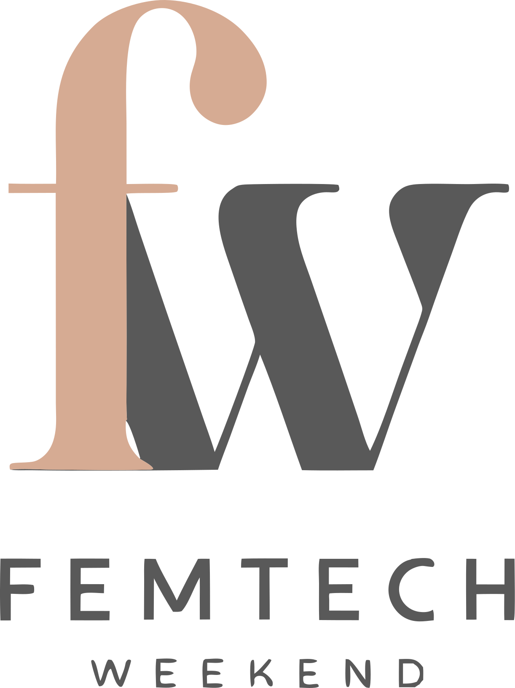
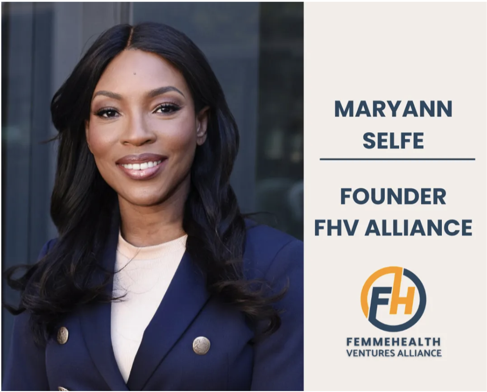
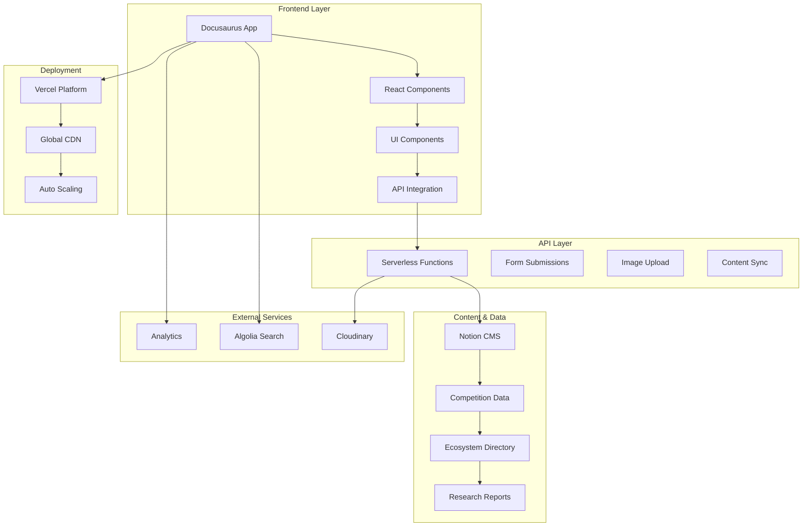
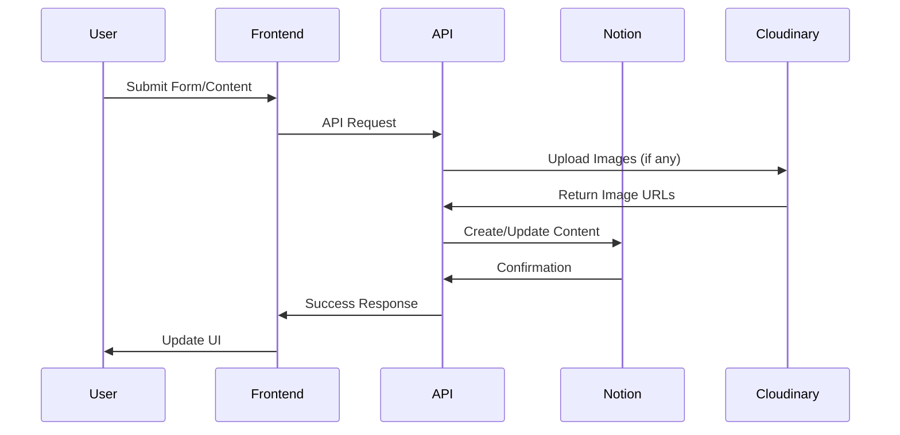

<div align="center"><a name="readme-top"></a>

[](#)

# 🚀 FemTech Weekend Platform<br/><h3>Empowering Women's Health Innovation in China & Globally</h3>

A comprehensive production-ready platform for FemTech Weekend - China's first organization focusing on women's health technology challenges.<br/>
Built with modern web technologies, supporting competition management, ecosystem directory, research insights, and global community building.<br/>
One-click **FREE** deployment of your FemTech innovation platform.

[Official Site][official-site] · [Live Platform][project-link] · [Documentation][docs] · [Competition][competition] · [Issues][github-issues-link]

<br/>

[][project-link]

<br/>

<!-- SHIELD GROUP -->

[![][github-release-shield]][github-release-link]
[![][vercel-shield]][vercel-link]
[![][discord-shield]][discord-link]<br/>
[![][github-action-test-shield]][github-action-test-link]
[![][github-releasedate-shield]][github-releasedate-link]<br/>
[![][github-contributors-shield]][github-contributors-link]
[![][github-forks-shield]][github-forks-link]
[![][github-stars-shield]][github-stars-link]
[![][github-issues-shield]][github-issues-link]
[![][github-license-shield]][github-license-link]<br>
[![][sponsor-shield]][sponsor-link]

**Share FemTech Weekend Platform**

[![][share-x-shield]][share-x-link]
[![][share-telegram-shield]][share-telegram-link]
[![][share-whatsapp-shield]][share-whatsapp-link]
[![][share-reddit-shield]][share-reddit-link]
[![][share-weibo-shield]][share-weibo-link]
[![][share-linkedin-shield]][share-linkedin-link]

<sup>🌟 Pioneering the future of women's health technology. Built for the next generation of FemTech innovators.</sup>

[![][github-trending-shield]][github-trending-url]

## 📸 Platform Screenshots

> [!TIP]
> Experience the power of our comprehensive FemTech platform designed for innovation, community, and research.

<div align="center">
  
  <p><em>Homepage - Connecting FemTech Innovation Across China and Globally</em></p>
</div>

<div align="center">
  
  
  <p><em>Research Reports Hub and Strategic Partnerships</em></p>
</div>

**Tech Stack Badges:**

<div align="center">

 
 
 
 
 
 

</div>

</div>

> [!IMPORTANT]
> This project demonstrates modern full-stack development practices for FemTech innovation platforms. It combines Docusaurus with React components, serverless APIs, and headless CMS to provide comprehensive competition management, ecosystem building, and research dissemination capabilities.

<details>
<summary><kbd>📑 Table of Contents</kbd></summary>

#### TOC

- [🚀 FemTech Weekend Platform](#-femtech-weekend-platform)
      - [TOC](#toc)
  - [🌟 Introduction](#-introduction)
  - [✨ Key Features](#-key-features)
    - [`1` Competition Management Platform](#1-competition-management-platform)
    - [`2` Ecosystem Directory & Community](#2-ecosystem-directory--community)
    - [`3` Research & Insights Hub](#3-research--insights-hub)
    - [`*` Additional Features](#-additional-features)
  - [🛠️ Tech Stack](#️-tech-stack)
  - [🏗️ Architecture](#️-architecture)
    - [System Architecture](#system-architecture)
    - [Content Management Flow](#content-management-flow)
    - [Component Structure](#component-structure)
  - [⚡️ Performance](#️-performance)
  - [🚀 Getting Started](#-getting-started)
    - [Prerequisites](#prerequisites)
    - [Quick Installation](#quick-installation)
    - [Environment Setup](#environment-setup)
    - [Development Mode](#development-mode)
  - [🛳 Deployment](#-deployment)
    - [`A` Vercel Deployment](#a-vercel-deployment)
    - [`B` Environment Variables](#b-environment-variables)
  - [📖 Usage Guide](#-usage-guide)
    - [Competition Management](#competition-management)
    - [Ecosystem Directory](#ecosystem-directory)
    - [API Reference](#api-reference)
  - [🔌 Integrations](#-integrations)
  - [⌨️ Development](#️-development)
    - [Local Development](#local-development)
    - [Adding Features](#adding-features)
    - [Internationalization](#internationalization)
  - [🤝 Contributing](#-contributing)
    - [Development Process](#development-process)
    - [Contribution Guidelines](#contribution-guidelines)
  - [📄 License](#-license)
  - [👥 Team](#-team)

####

<br/>

</details>

## 🌟 Introduction

We are passionate developers creating the future of women's health technology innovation. FemTech Weekend is China's first organization focusing on women's health technology challenges, dedicated to widely spreading advanced FemTech concepts and fostering global collaboration in women's health innovation.

This platform serves as the comprehensive digital hub for:
- **Competition Management**: Hosting China's premier FemTech hackathons and innovation challenges
- **Ecosystem Building**: Connecting 200+ founders, investors, corporates, and healthcare professionals
- **Research Dissemination**: Publishing cutting-edge insights on women's health technology trends
- **Global Bridge**: Facilitating China-international FemTech collaboration and knowledge exchange

> [!NOTE]
> - Node.js >= 18.0 required
> - Notion API access required for content management
> - Cloudinary account recommended for image uploads
> - Bilingual support (English/Chinese) built-in

| [![][demo-shield-badge]][demo-link]   | Experience our live platform with competition registration and ecosystem directory.                           |
| :------------------------------------ | :--------------------------------------------------------------------------------------------- |
| [![][discord-shield-badge]][discord-link] | Join our FemTech community! Connect with innovators, investors, and healthcare professionals. |

> [!TIP]
> **⭐ Star us** to stay updated with the latest FemTech innovations and platform releases!

## ✨ Key Features

### `1` Competition Management Platform

Experience next-generation hackathon and competition management. Our innovative platform provides comprehensive tools for organizing, managing, and showcasing FemTech innovation challenges that drive women's health technology forward.

Key capabilities include:
- 🏆 **Multi-Stage Competitions**: Registration, submission, judging, and showcase workflows
- 📊 **Real-time Analytics**: Track participation, engagement, and impact metrics
- 🌐 **Bilingual Support**: Full English/Chinese localization for global participation
- 🔗 **Integration Ready**: Seamless connection with judging platforms and communication tools

### `2` Ecosystem Directory & Community

Revolutionary community platform that transforms how FemTech stakeholders connect and collaborate. With our comprehensive member directory and networking tools, users can discover opportunities, find partners, and build the future of women's health together.

**Available Categories:**
- **FemTech Founders**: Entrepreneurs building women's health solutions
- **Investors & VCs**: Funding partners focused on FemTech investments
- **Healthcare Professionals**: Medical experts and practitioners
- **Academic Researchers**: Scientists and researchers advancing women's health
- **Corporate Partners**: Companies supporting FemTech innovation

### `3` Research & Insights Hub

Comprehensive research platform delivering investment-grade insights on FemTech market trends, innovation patterns, and strategic opportunities across China and global markets.

**Research Areas:**
- 📈 **Market Analysis**: FemTech market maps and trend reports
- 💰 **Investment Insights**: Funding data and investor landscape analysis
- 🔬 **Technology Trends**: AI, digital health, and emerging tech in women's health
- 🌏 **Regional Focus**: Greater China market with global perspectives

### `*` Additional Features

Beyond the core platform, FemTech Weekend includes:

- [x] 🚀 **One-Click Deployment**: Deploy your own FemTech platform in minutes
- [x] 🌐 **International Ready**: Full bilingual support with cultural adaptation
- [x] 🔒 **Privacy Focused**: Secure data handling with GDPR compliance
- [x] 💎 **Modern UI/UX**: Beautiful design optimized for women's health community
- [x] 📱 **Mobile Responsive**: Perfect experience across all devices
- [x] 📊 **Analytics Dashboard**: Comprehensive insights on community engagement
- [x] 🔌 **API Integration**: Notion CMS, Cloudinary, and third-party services
- [x] 📈 **SEO Optimized**: Search engine optimization for maximum visibility

> ✨ More features are continuously being added as the FemTech ecosystem evolves.

## 🛠️ Tech Stack

<div align="center">
  <table>
    <tr>
      <td align="center" width="96">
        
        <br>Docusaurus 3.7
      </td>
      <td align="center" width="96">
        
        <br>React 18
      </td>
      <td align="center" width="96">
        
        <br>TypeScript 5
      </td>
      <td align="center" width="96">
        
        <br>Tailwind CSS
      </td>
      <td align="center" width="96">
        
        <br>Notion API
      </td>
      <td align="center" width="96">
        
        <br>Cloudinary
      </td>
      <td align="center" width="96">
        
        <br>Vercel
      </td>
    </tr>
  </table>
</div>

**Frontend Stack:**
- **Framework**: Docusaurus 3.7 with React 18
- **Language**: TypeScript for type safety
- **Styling**: TailwindCSS + Custom Design System
- **UI Components**: Radix UI + Custom FemTech Components
- **Animations**: GSAP + Framer Motion

**Backend & Content:**
- **API**: Serverless functions on Vercel
- **CMS**: Notion as headless content management
- **Media**: Cloudinary for optimized image delivery
- **Search**: Algolia for powerful site search
- **Analytics**: Integrated tracking and insights

**DevOps & Deployment:**
- **Platform**: Vercel with global CDN
- **CI/CD**: GitHub Actions automation
- **Monitoring**: Performance and error tracking
- **Internationalization**: Built-in i18n support

> [!TIP]
> Each technology was carefully selected for production readiness, developer experience, and scalability in the FemTech innovation space.

## 🏗️ Architecture

### System Architecture



### Content Management Flow



### Component Structure

```
src/
├── components/           # React UI components
│   ├── AboutUs/         # About page components
│   ├── Competition/     # Competition management
│   ├── Ecosystem/       # Community directory
│   ├── Reports/         # Research hub
│   └── ui/              # Reusable UI components
├── data/                # Static data and configurations
├── constants/           # Application constants
├── types/               # TypeScript definitions
├── utils/               # Utility functions
└── pages/               # Main application pages
```

## ⚡️ Performance

### Key Metrics

**Lighthouse Scores:**
- ⚡ **Performance**: 95+ score across all pages
- ♿ **Accessibility**: 100 score with WCAG compliance
- 🎯 **Best Practices**: 100 score with security headers
- 🔍 **SEO**: 100 score with optimized meta tags

**Platform Performance:**
- 🚀 **< 2s** Page load times globally
- 💨 **< 500ms** API response times
- 📊 **99.9%** Uptime reliability
- 🔄 **Real-time** content synchronization

**Optimization Features:**
- 🎯 **Smart Caching**: Multi-layer caching strategy
- 📦 **Code Splitting**: Automatic bundle optimization
- 🖼️ **Image Optimization**: Cloudinary with WebP support
- 🌐 **CDN**: Global content delivery network

## 🚀 Getting Started

### Prerequisites

> [!IMPORTANT]
> Ensure you have the following installed:

- Node.js 18.0+ ([Download](https://nodejs.org/))
- npm/yarn/pnpm package manager
- Git ([Download](https://git-scm.com/))
- Notion account and API token
- Cloudinary account (optional, for image uploads)

### Quick Installation

**1. Clone Repository**

```bash
git clone https://github.com/ChanMeng666/femtech-weekend-website.git
cd femtech-weekend-website
```

**2. Install Dependencies**

```bash
# Using npm
npm install

# Using yarn
yarn install

# Using pnpm (recommended)
pnpm install
```

**3. Environment Setup**

```bash
# Copy environment template
cp .env.example .env.local

# Edit environment variables
nano .env.local
```

**4. Start Development**

```bash
# Start development server
npm run dev

# Or start with API server
npm run dev
```

🎉 **Success!** Open [http://localhost:3000](http://localhost:3000) to view the platform.

### Environment Setup

Create `.env.local` file with the following variables:

```bash
# Notion Configuration
NOTION_TOKEN="your_notion_integration_token"
NOTION_DATABASE_ID="your_main_database_id"
PDF_FORM_DATABASE_ID="your_pdf_form_database_id"

# Cloudinary Configuration (Optional)
CLOUDINARY_CLOUD_NAME="your_cloud_name"
CLOUDINARY_API_KEY="your_api_key"
CLOUDINARY_API_SECRET="your_api_secret"

# Environment
NODE_ENV="development"
```

### Development Mode

```bash
# Development with hot reload
npm run start

# API server (if needed separately)
npm run api

# Full development stack
npm run dev

# Build for production
npm run build

# Type checking
npm run typecheck
```

## 🛳 Deployment

> [!IMPORTANT]
> The platform is optimized for Vercel deployment with serverless functions and global CDN distribution.

### `A` Vercel Deployment

**One-Click Deploy:**

[](https://vercel.com/new/clone?repository-url=https%3A%2F%2Fgithub.com%2FChanMeng666%2Ffemtech-weekend-website)

**Manual Deployment:**

```bash
# Install Vercel CLI
npm i -g vercel

# Deploy to production
vercel --prod
```

**Deployment Configuration:**
```json
// vercel.json
{
  "builds": [
    { "src": "package.json", "use": "@vercel/static-build" },
    { "src": "api/**/*.js", "use": "@vercel/node" }
  ],
  "routes": [
    { "src": "/api/(.*)", "dest": "/api/$1" },
    { "handle": "filesystem" },
    { "src": "/(.*)", "dest": "/$1" }
  ]
}
```

### `B` Environment Variables

> [!WARNING]
> Never commit sensitive environment variables to version control. Use Vercel's environment variables dashboard for production deployment.

| Variable | Description | Required | Example |
|----------|-------------|----------|---------|
| `NOTION_TOKEN` | Notion integration token | ✅ | `secret_xxxxxxxxxxxxx` |
| `NOTION_DATABASE_ID` | Main ecosystem database ID | ✅ | `xxxxxxxx-xxxx-xxxx-xxxx-xxxxxxxxxxxx` |
| `PDF_FORM_DATABASE_ID` | PDF form submissions database | ✅ | `xxxxxxxx-xxxx-xxxx-xxxx-xxxxxxxxxxxx` |
| `CLOUDINARY_CLOUD_NAME` | Cloudinary account name | 🔶 | `your-cloud-name` |
| `CLOUDINARY_API_KEY` | Cloudinary API key | 🔶 | `123456789012345` |
| `CLOUDINARY_API_SECRET` | Cloudinary API secret | 🔶 | `your-api-secret` |
| `NODE_ENV` | Environment mode | 🔶 | `production` |

> [!NOTE]
> ✅ Required, 🔶 Optional

## 📖 Usage Guide

### Competition Management

**Getting Started with Competitions:**

1. **Access Competition Dashboard** via `/competition`
2. **Register for Events** through the integrated form system
3. **Track Progress** with real-time updates and notifications
4. **Submit Projects** via the submission portal

### Ecosystem Directory

**Join the FemTech Community:**

1. **Browse Members** at `/ecosystem` to discover founders, investors, and partners
2. **Apply to Join** using the comprehensive application form at `/ecosystem/join`
3. **Network & Connect** with like-minded FemTech professionals
4. **Access Resources** including research reports and market insights

### API Reference

> [!TIP]
> All API endpoints support JSON format and include proper error handling and validation.

**Form Submission Endpoints:**

```bash
# Ecosystem membership application
POST /api/submit-ecosystem
Content-Type: application/json

{
  "name": "Jane Doe",
  "email": "jane@example.com",
  "companyName": "HealthTech Innovations",
  "companyWebsite": "https://healthtech.com",
  "founderName": "Jane Doe",
  "businessDescription": "AI-powered women's health platform",
  "businessStage": "Series A",
  "categories": ["AI/ML", "Digital Health"]
}

# PDF download with form collection
POST /api/pdf-form-submit
Content-Type: application/json

{
  "firstName": "Jane",
  "lastName": "Doe", 
  "email": "jane@example.com",
  "company": "Tech Corp",
  "website": "https://techcorp.com",
  "country": "China",
  "pdfUrl": "https://example.com/report.pdf"
}

# Image upload to Cloudinary
POST /api/upload-image
Content-Type: multipart/form-data

FormData:
- file: [image file]
- folder: "ecosystem" (optional)
```

## 🔌 Integrations

We support integration with leading platforms and services:

| Category | Service | Status | Documentation |
|----------|---------|--------|---------------|
| **Content Management** | Notion API | ✅ Active | [Setup Guide](docs/notion.md) |
| **Media Storage** | Cloudinary | ✅ Active | [Setup Guide](docs/cloudinary.md) |
| **Search** | Algolia | ✅ Active | [Setup Guide](docs/algolia.md) |
| **Analytics** | Google Analytics | ✅ Active | [Setup Guide](docs/analytics.md) |
| **Deployment** | Vercel | ✅ Active | [Setup Guide](docs/vercel.md) |
| **Monitoring** | Sentry | 🔶 Optional | [Setup Guide](docs/sentry.md) |

> 📊 Total integrations: [<kbd>**10+**</kbd>](https://femtech-weekend-website.vercel.app/docs)

## ⌨️ Development

### Local Development

**Setup Development Environment:**

```bash
# Clone repository
git clone https://github.com/ChanMeng666/femtech-weekend-website.git
cd femtech-weekend-website

# Install dependencies
npm install

# Setup environment
cp .env.example .env.local

# Start development
npm run dev
```

**Development Scripts:**

```bash
# Development
npm run start        # Start Docusaurus dev server
npm run api          # Start API server
npm run dev          # Start both servers concurrently

# Building
npm run build        # Production build
npm run serve        # Preview build locally
npm run clear        # Clear build cache

# Quality
npm run typecheck    # TypeScript validation
npm run swizzle      # Customize Docusaurus components

# Localization
npm run write-translations    # Generate translation files
npm run write-heading-ids     # Generate heading IDs
```

### Adding Features

**1. Create Feature Structure:**

```bash
# Add new component
mkdir src/components/NewFeature
touch src/components/NewFeature/index.tsx
touch src/components/NewFeature/README.md
```

**2. Feature Development Guidelines:**

- ✅ Follow TypeScript best practices
- ✅ Add comprehensive documentation
- ✅ Include internationalization support
- ✅ Follow accessibility guidelines
- ✅ Add proper error handling

### Internationalization

The platform supports full bilingual functionality:

**Adding New Translations:**

```json
// i18n/en/code.json
{
  "newFeature.title": "New Feature Title",
  "newFeature.description": "Feature description"
}

// i18n/zh-Hans/code.json  
{
  "newFeature.title": "新功能标题",
  "newFeature.description": "功能描述"
}
```

**Usage in Components:**
```tsx
import { translate } from '@docusaurus/Translate';

const title = translate({
  id: 'newFeature.title',
  message: 'Default Title',
});
```

## 🤝 Contributing

We welcome contributions to the FemTech Weekend platform! Here's how you can help improve this project:

### Development Process

**1. Fork & Clone:**

```bash
git clone https://github.com/ChanMeng666/femtech-weekend-website.git
cd femtech-weekend-website
```

**2. Create Branch:**

```bash
git checkout -b feature/your-feature-name
```

**3. Make Changes:**

- Follow our coding standards
- Add tests for new features  
- Update documentation as needed
- Ensure all tests pass

**4. Submit PR:**

- Provide clear description
- Include screenshots for UI changes
- Reference related issues
- Ensure CI passes

### Contribution Guidelines

**Code Style:**
- Use TypeScript for type safety
- Follow ESLint and Prettier configuration
- Write meaningful commit messages
- Add JSDoc comments for public APIs

**Pull Request Process:**
1. Update README.md if needed
2. Add tests for new functionality
3. Ensure all tests pass
4. Request review from maintainers

**Issue Reporting:**
- 🐛 **Bug Reports**: Include reproduction steps
- 💡 **Feature Requests**: Explain use case and benefits
- 📚 **Documentation**: Help improve our docs
- ❓ **Questions**: Use GitHub Discussions

[![][pr-welcome-shield]][pr-welcome-link]

## 📄 License

This project is licensed under the MIT License - see the [LICENSE](LICENSE) file for details.

**Open Source Benefits:**
- ✅ Commercial use allowed
- ✅ Modification allowed
- ✅ Distribution allowed
- ✅ Private use allowed

## 👥 Team

<div align="center">
  <table>
    <tr>
      <td align="center">
        <a href="https://github.com/ChanMeng666">
          
          <br />
          <sub><b>Chan Meng</b></sub>
        </a>
        <br />
        <small>Platform Developer & Technical Lead</small>
      </td>
      <td align="center">
        
        <br />
        <sub><b>Zhu Yihan</b></sub>
        <br />
        <small>Founder & CEO, FemTech Weekend</small>
      </td>
    </tr>
  </table>
</div>

**Contact Information:**
- 📧 **Email**: [hello@femtechweekend.com](mailto:hello@femtechweekend.com)
- 💼 **LinkedIn**: [FemTech Weekend](https://linkedin.com/company/femtech-weekend)
- 🌐 **Website**: [www.femtechweekend.com](https://www.femtechweekend.com)
- 💬 **GitHub**: [Project Repository](https://github.com/ChanMeng666/femtech-weekend-website)

**Developer Contact:**
-  LinkedIn: [chanmeng666](https://www.linkedin.com/in/chanmeng666/)
-  GitHub: [ChanMeng666](https://github.com/ChanMeng666)
-  Email: chanmeng.dev@gmail.com

---

<div align="center">
<strong>🚀 Empowering Women's Health Innovation 🌟</strong>
<br/>
<em>Rooted in China, Connecting Globally</em>
<br/><br/>

⭐ **Star us on GitHub** • 📖 **Read the Documentation** • 🐛 **Report Issues** • 💡 **Request Features** • 🤝 **Contribute**

<br/><br/>

**Made with ❤️ by the FemTech Weekend team**


</div>

---

<!-- LINK DEFINITIONS -->

[back-to-top]: https://img.shields.io/badge/-BACK_TO_TOP-151515?style=flat-square

<!-- Project Links -->
[official-site]: https://www.femtechweekend.com
[project-link]: https://femtech-weekend-website.vercel.app
[docs]: https://femtech-weekend-website.vercel.app/docs
[competition]: https://femtech-weekend-website.vercel.app/competition
[demo-link]: https://femtech-weekend-website.vercel.app

<!-- GitHub Links -->
[github-issues-link]: https://github.com/ChanMeng666/femtech-weekend-website/issues
[github-stars-link]: https://github.com/ChanMeng666/femtech-weekend-website/stargazers
[github-forks-link]: https://github.com/ChanMeng666/femtech-weekend-website/forks
[github-contributors-link]: https://github.com/ChanMeng666/femtech-weekend-website/contributors
[github-release-link]: https://github.com/ChanMeng666/femtech-weekend-website/releases
[github-license-link]: https://github.com/ChanMeng666/femtech-weekend-website/blob/main/LICENSE

<!-- Community Links -->
[discord-link]: https://discord.gg/femtech-weekend
[sponsor-link]: https://opencollective.com/femtech-weekend

<!-- Shield Badges -->
[github-release-shield]: https://img.shields.io/github/v/release/ChanMeng666/femtech-weekend-website?color=369eff&labelColor=black&logo=github&style=flat-square
[vercel-shield]: https://img.shields.io/badge/vercel-online-55b467?labelColor=black&logo=vercel&style=flat-square
[discord-shield]: https://img.shields.io/discord/123456789?color=5865F2&label=discord&labelColor=black&logo=discord&logoColor=white&style=flat-square
[github-action-test-shield]: https://img.shields.io/github/actions/workflow/status/ChanMeng666/femtech-weekend-website/test.yml?label=test&labelColor=black&logo=githubactions&logoColor=white&style=flat-square
[github-releasedate-shield]: https://img.shields.io/github/release-date/ChanMeng666/femtech-weekend-website?labelColor=black&style=flat-square
[github-contributors-shield]: https://img.shields.io/github/contributors/ChanMeng666/femtech-weekend-website?color=c4f042&labelColor=black&style=flat-square
[github-forks-shield]: https://img.shields.io/github/forks/ChanMeng666/femtech-weekend-website?color=8ae8ff&labelColor=black&style=flat-square
[github-stars-shield]: https://img.shields.io/github/stars/ChanMeng666/femtech-weekend-website?color=ffcb47&labelColor=black&style=flat-square
[github-issues-shield]: https://img.shields.io/github/issues/ChanMeng666/femtech-weekend-website?color=ff80eb&labelColor=black&style=flat-square
[github-license-shield]: https://img.shields.io/badge/license-MIT-white?labelColor=black&style=flat-square
[sponsor-shield]: https://img.shields.io/badge/-Sponsor%20Project-f04f88?logo=opencollective&logoColor=white&style=flat-square
[github-trending-shield]: https://trendshift.io/api/badge/repositories/123456

<!-- Badge Variants -->
[demo-shield-badge]: https://img.shields.io/badge/TRY%20PLATFORM-LIVE-55b467?labelColor=black&logo=vercel&style=for-the-badge
[discord-shield-badge]: https://img.shields.io/badge/JOIN%20COMMUNITY-DISCORD-5865F2?labelColor=black&logo=discord&logoColor=white&style=for-the-badge

<!-- Social Share Links -->
[share-x-link]: https://x.com/intent/tweet?hashtags=femtech,opensource&text=Check%20out%20FemTech%20Weekend%20Platform&url=https%3A%2F%2Fgithub.com%2FChanMeng666%2Ffemtech-weekend-website
[share-telegram-link]: https://t.me/share/url?text=FemTech%20Weekend%20Platform&url=https%3A%2F%2Fgithub.com%2FChanMeng666%2Ffemtech-weekend-website
[share-whatsapp-link]: https://api.whatsapp.com/send?text=FemTech%20Weekend%20Platform%20https%3A%2F%2Fgithub.com%2FChanMeng666%2Ffemtech-weekend-website
[share-reddit-link]: https://www.reddit.com/submit?title=FemTech%20Weekend%20Platform&url=https%3A%2F%2Fgithub.com%2FChanMeng666%2Ffemtech-weekend-website
[share-weibo-link]: http://service.weibo.com/share/share.php?title=FemTech%20Weekend%20Platform&url=https%3A%2F%2Fgithub.com%2FChanMeng666%2Ffemtech-weekend-website
[share-linkedin-link]: https://linkedin.com/sharing/share-offsite/?url=https://github.com/ChanMeng666/femtech-weekend-website

[share-x-shield]: https://img.shields.io/badge/-share%20on%20x-black?labelColor=black&logo=x&logoColor=white&style=flat-square
[share-telegram-shield]: https://img.shields.io/badge/-share%20on%20telegram-black?labelColor=black&logo=telegram&logoColor=white&style=flat-square
[share-whatsapp-shield]: https://img.shields.io/badge/-share%20on%20whatsapp-black?labelColor=black&logo=whatsapp&logoColor=white&style=flat-square
[share-reddit-shield]: https://img.shields.io/badge/-share%20on%20reddit-black?labelColor=black&logo=reddit&logoColor=white&style=flat-square
[share-weibo-shield]: https://img.shields.io/badge/-share%20on%20weibo-black?labelColor=black&logo=sinaweibo&logoColor=white&style=flat-square
[share-linkedin-shield]: https://img.shields.io/badge/-share%20on%20linkedin-black?labelColor=black&logo=linkedin&logoColor=white&style=flat-square

<!-- Trending -->
[github-trending-url]: https://trendshift.io/repositories/123456

<!-- PR Welcome -->
[pr-welcome-shield]: https://img.shields.io/badge/🤝_PRs_welcome-%E2%86%92-ffcb47?labelColor=black&style=for-the-badge
[pr-welcome-link]: https://github.com/ChanMeng666/femtech-weekend-website/pulls
