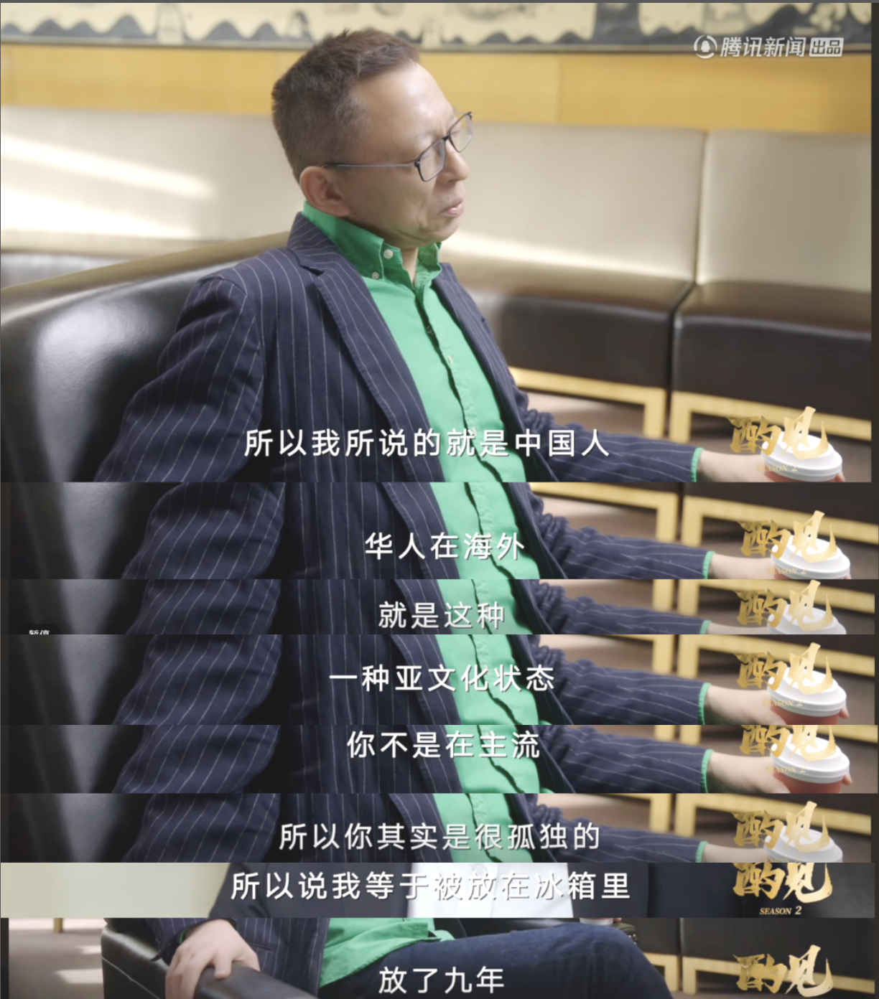
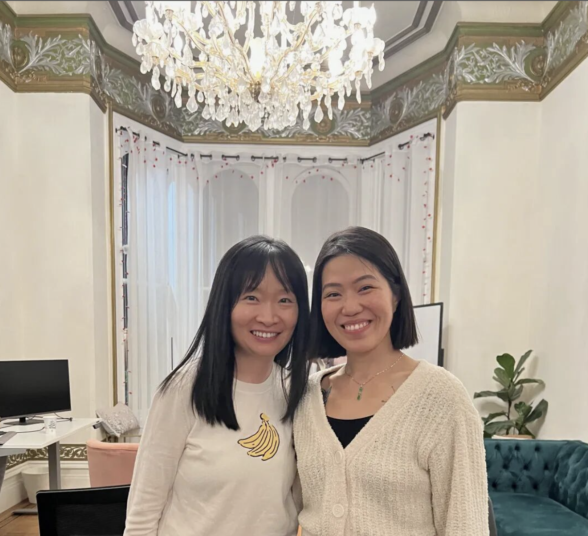

# 从钢琴少女到改变14万女性生育旅程的科技创业者：康曼曼的跨界人生交响曲

**"在美国创业就像被冻在冰箱里，难以破冰，也难以融入。"**

张朝阳曾对俞敏洪说过这句话，恰如其分地描述了许多中国创业者在异国他乡面临的孤独与格格不入——陌生的环境、难以被看见、听见、和理解的现实。

但一位来自成都的女性，正用自己的故事改写这个叙述。全球已有120多个国家的14万多名女性使用了她的发明—— Mira，陪伴她们走过人生最私密、最情感化的旅程之一——生育。

在创办 Mira 之前，Sylvia Kang (康曼曼) 便斩获了多个国际钢琴比赛奖项，后来又在匹兹堡大学获得生物工程学士学位，于哥伦比亚大学获得硕士学位，并在康奈尔大学攻读 MBA。

她曾在一家世界500强生命科学企业工作近十年，管理着价值超过1亿美元的全球业务。但当她亲眼看到朋友在生育路上遭遇的种种困境时，意识到女性健康，尤其是生育护理的系统有多么破碎与不透明。这个冰冷的现实促使她创办了 Mira——一款便携式、AI驱动的居家激素检测设备，用尿液测试取代了抽血检查，为女性提供实验室级别、个性化的周期洞察。

康曼曼用亲身经历证明：中国女性创业者，即使身处异国，也能创造奇迹。

## 第一乐章：黑白键上的跨界幻想曲

"四岁就开始练琴，这是我家人为我选择的道路。"

成长于成都一个传统的中国家庭，她的生活围绕着钢琴练习、演奏会、与比赛展开。她的父母尤其是母亲，对她的要求极为严格，每天需练习五六小时。她的努力也换来了成果——斩获多个国际大奖，并顺利考入培养顶尖音乐人才的四川音乐学院附中。

但在她手指飞舞于琴键之间时，思绪却被另一种声音吸引。在川音附中的求学期间，康曼曼渐渐发现自己对科学有着难以抑制的热爱。这种热爱或许来自她的祖父——中国生物医学工程创始人。"他经常跟我讲他的研究和发明，我每次都很着迷。"她说，"但当时在四川音乐学院附中整整6年都没有理科课程，所以我决定自己学。"

12岁时，当同龄人沉浸于练琴时，康曼曼却在偷偷啃数学、化学，物理、和生物的初高中教材。她过着双重人生——白天是音乐才女，晚上是科学狂热分子。最终，她做出惊人决定：放弃学了13年的钢琴专业，转而追逐生物工程的梦想。

"我记得跟老师和其他长辈说我要申请去美国读理工科时，没有一个人相信这对我是一个好的选择。他们不认为放弃13年的钢琴专业是可取的，也不相信我从零开始读理工科能有多少优势。"她说。

但这就是康曼曼 ——她不只是追梦人，更是跨越不同世界之间的越界者，让不可能变成可能。

## 第二乐章：初创之路的变奏曲

经过6年自学理科课程，她申请到美国匹兹堡大学主修生物工程，而后在哥伦比亚大学完成硕士学业，之后又在康奈尔大学拿到 MBA 学位。随后，她进入美国康宁公司，迅速晋升，29岁即任商业总监，总管横跨全球的一亿美元的业务。"康宁是一家美国传统大公司，晋升有很严格的要求。那时候我的同级平均年龄50岁，80%都是白人男性"，她说。

那时她的很多朋友都进入了生育年龄。这使她发现备孕是一件极其困难的事。 "我想做一个能直接帮到别人的产品。那时候市面上有一堆健康追踪器，但没有一款能精准测量女性的激素健康。"

> "看到朋友们在30多岁时努力怀孕却屡屡失败而不得不去做昂贵和痛苦的辅助生殖时，我才意识到女性健康医疗有多么混乱、昂贵、以及凭臆断。这太荒谬了！我不敢相信在21世纪的今天，居然还没有任何能让女性或者医生了解激素健康的工具。"

早在业界或投资人注意到之前，康曼曼就洞察到了女性健康领域的巨大空白。2016年，家用激素检测几乎不存在，女性健康的关键指标也长期被忽视。Mira 的灵感，不是在实验室诞生的，而是在一位女性对答案的渴望中萌芽的。

于是她辞去高薪职位，投身初创，开启了"炼狱模式"。

> "我同时在建三家公司——硬件、生物试剂和 AI 软件——可我对其中一大部分技术和认证都一无所知，只能从头学起。我买了台 3D 打印机，自己打样做原型。"

她还面临男投资人的质疑：

> "创业路演的时候我还得从什么是黄体生成素讲起，像在上基础生物课一样。有些人根本没兴趣了解，有些人勉强根据自己妻子备孕的经历随便敷衍两句。"

医疗投资人更青睐 B2B 模式，而消费类投资人又偏好订阅制 App。

但她始终坚持自己的 DTC 模式（直接面对消费者），因为她的出发点从来都是想要解决真正的市场空缺。

她不是追随潮流的人，她是预测潮流的人。

2018年，AI在医疗领域尚属前沿，康曼曼却把它作为 Mira 的核心技术。如今，Mira 的 AI 已分析超 2200 万个匿名激素数据点和 85 万个周期数据，推动了女性健康研究并提供前所未有的个性化生育洞察。

建立 Mira 绝非易事。生殖健康一直是医疗领域资金最少、最被忽视的角落之一，尤其缺乏实时、个性化的数据支持。但她都一路扛下来了。到了 2023 年，Mira 从检测2种激素扩展到4种，帮助用户了解如多囊卵巢综合征（PCOS）、激素失衡和排卵问题等状况。这一升级不仅扩大了 Mira 的全球影响力，也引领了整个生育护理领域的讨论，把 AI 家用检测推到了最前沿。

创业仅三年，Mira 就获得了FDA认证，并开始重新定义女性激素健康的新篇章。许多被诊断为"不明原因不孕"的女性避免了不必要的辅助生殖疗程，提早发现激素问题，并首次真正理解自己的身体。

至今，Mira 已完成600万美元融资，实现数千万美元营收，并在全球120多个国家拥有超过14万用户——这恰恰证明了从女性用户需求出发且对女性友好的健康工具正是这个时代所渴求的。

## 第三乐章：创新的协奏曲

Mira 不只是一个排卵试纸——它是你手中的临床级激素实验室。它的核心技术是专利荧光免疫测试和 AI智能算法，是市面上最先进的家用生育监测仪。

它检测四种关键激素：

- ✔️ LH（黄体生成素）：用于精准识别排卵
- ✔️ E3G（雌三醇葡糖苷）：用于完整描绘受孕窗口
- ✔️ PdG（孕酮代谢物）：用于确认排卵是否真正发生
- ✔️ FSH（促卵泡激素）：用于评估卵巢储备及更年期阶段

"这是唯一一款能提供定量、个性化激素数据，并能被医生采信的解决方案。"康曼曼说。"虽然是家用设备，但数据精准度足以用于医疗决策。"不再是模糊预测或试纸变色，而是明确、可操作的结果——这能为女性节省数千美元和数月的检测时间。

更令人瞩目的是，Mira配备了AI驱动的算法系统，该系统基于大约2200万个荷尔蒙数据分析训练，能够为用户提供个性化的预测和建议。这种结合了实验室级检测技术和人工智能的创新方案，让Mira在准确性和便利性上都达到了行业领先水平。

> "在生育治疗过程中，在家进行激素水平检测可以显著减轻女性的负担。女性可以在家中方便无痛地进行检测，检测结果立即通过应用程序传递给医生。这也减轻了生育诊所或医疗系统的护理负担。总的来说，像Mira这样的设备通过扩大护理可及性和改善患者体验，是一项极具意义的创新。"

## 第四乐章：自我管理的协奏曲

**创业最难的部分其实不是技术的突破，而是坚定的心志。最难的不是领导团队，而是领导自己**

康曼曼坦言，早期研发遇阻、自我怀疑、巨大压力都是常态。但她学会了像调音一样管理自己的思维状态。

> "我会问自己：这个问题的真正根源是什么？什么是我能改变的？优先级是什么？然后逐步拆解。"

这一思维方式成为她的强大武器。如今，Mira 拥有全球160多名员工，用户量相当于两个鸟巢的观众席。84%的用户在6个周期内成功怀孕，同时Mira也协助女性避免昂贵的辅助生殖、提前诊断 PCOS、甚至提早发现围绝经期。

"我们不仅是一个设备，更是女性在最需要时刻的陪伴者。"

## 第五乐章：全球协作的圆舞曲

在康曼曼带领下，Mira 不仅拓展了产品线，也扩展了使命——让激素检测变得更便捷、更普及。作为美国增长最快的FemTech公司， Mira 推出了远程生育健康诊所，已为数千位女性（尤其是偏远地区）提供远程护理。她还主导推出 Mira 更年期检测，帮助女性应对围绝经期，提供个性化、更科学的建议。

> "我们知道，生育会受多种因素影响——心理状态、饮食、压力、和整体的身心健康。我们的诊所为用户提供个性化建议，帮助她们调节激素和掌控健康"

在产品之外，Mira 也在推动行业共识与公共意识。2024年，Mira 发起获奖的"性激素意识运动"，创立了全球首个"性激素意识周"，显著提升了激素健康的公共讨论度。

康曼曼深知科研与数据对于女性健康发展的重要性。Mira 与 Oura Ring 等领先健康科技公司合作，建立女性健康大数据库，并与西奈山医院、约翰霍普金斯大学、墨尔本大学等机构，和几千位临床医生合作，研究激素、心理健康、生活方式，月经周期以及更年期对职业生涯的影响。这些项目正推动政策的改变和女性在职场健康中的保障。

> "我们真的找到了产品与市场的匹配点，并建立起了一支卓越的团队。这让我们稳健增长。"

除了发展Mira，她还致力于提高人们对女性健康研究和STEM领域女性参与度的认识。**"我在努力帮助提高人们对女性健康作为一个行业，或者被称为FemTech的行业的认识。全球女性是50%的人口，但它仍然被称为利基市场。"**

## 終章：未完待续的交响乐

张朝阳的"冰箱比喻"确实道出了一种孤独感，但他没说完："冰箱里冰冷冻不住燃烧的野心。"

> "创业就像弹钢琴，它需要技巧，更需要热情与坚持。最重要的是，不要忘记你为什么开始。"

在FemTech女性健康科技快速崛起的时代，康曼曼和 Mira 鼓舞着一代又一代创业者——**尤其是中国女性——去追逐梦想、将中国创新带向世界舞台**。

正如康曼曼所说：

> "科技的终极意义，是改善人的生活。不是看它多先进，而是看它能不能被使用到。"

从成都到硅谷，从川音到哥伦比亚大学、康奈尔大学，从钢琴家到CEO，康曼曼用实际行动告诉我们：**世界上没有什么不可能，只有不曾努力过的可能！**
