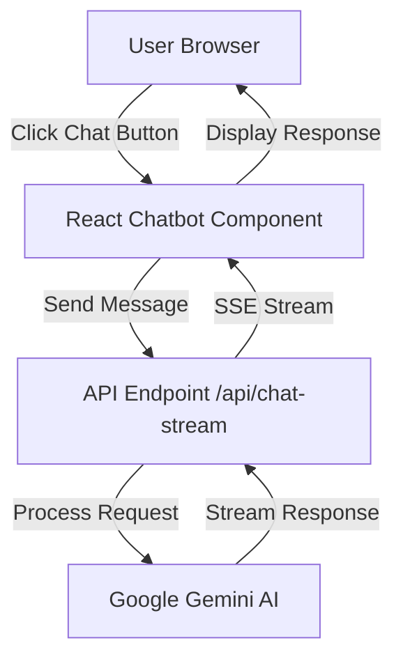

# AI Chatbot Integration Tutorial for Docusaurus Website

## Complete Guide: Integrating Google Gemini AI Chatbot into FemTech Weekend Docusaurus Site

### Table of Contents
1. [Overview](#overview)
2. [Prerequisites](#prerequisites)
3. [Architecture](#architecture)
4. [Step-by-Step Implementation](#step-by-step-implementation)
5. [Error Resolution Guide](#error-resolution-guide)
6. [UI/UX Optimization](#uiux-optimization)
7. [Security Best Practices](#security-best-practices)
8. [Testing & Deployment](#testing--deployment)
9. [Maintenance & Updates](#maintenance--updates)

---

## Overview

This tutorial documents the complete process of integrating a Google Gemini AI-powered chatbot into a Docusaurus 3.7 website. The chatbot provides intelligent responses about FemTech Weekend's mission, programs, team, and the Chinese women's health market.

### Key Features
- 🤖 Google Gemini AI integration (gemini-1.5-flash model)
- 💬 Real-time streaming responses using Server-Side Events (SSE)
- 🎨 Custom UI matching brand colors (#AA7C52)
- 📱 Responsive design for mobile and desktop
- 🔒 Secure API key management
- 🌏 Bilingual support (English/Chinese)
- ⚡ Quick preset questions for common queries

### Technology Stack
- **Frontend**: React 18, TypeScript, CSS Modules
- **Backend**: Node.js Express server for API endpoints
- **AI Model**: Google Gemini 1.5 Flash
- **Framework**: Docusaurus 3.7
- **Deployment**: Vercel (recommended)

---

## Prerequisites

### Required Software
```bash
# Check versions
node --version  # v18+ required
npm --version   # v8+ required
```

### Google Gemini API Key
1. Visit [Google AI Studio](https://makersuite.google.com/app/apikey)
2. Create a new API key
3. Save it securely (will be added to `.env.local`)

### Project Structure
```
femtech-weekend-website/
├── src/
│   ├── api/                    # API endpoints
│   │   └── chat-stream.js      # Gemini AI integration
│   ├── components/
│   │   └── Chatbot/            # Chatbot components
│   │       ├── index.tsx       # Main chatbot container
│   │       ├── ChatWindow.tsx  # Chat interface
│   │       ├── ChatMessage.tsx # Message component
│   │       ├── QuickActions.tsx # Preset questions
│   │       ├── presetQuestions.ts # Question data
│   │       ├── types.ts        # TypeScript types
│   │       └── styles.module.css # Styles
│   └── theme/
│       └── Root.js             # Global wrapper
├── api-server.js               # Express server
├── .env.local                  # Environment variables
└── package.json                # Dependencies
```

---

## Architecture

### System Architecture


### Component Architecture
```
<Root>                          // Global wrapper
  └── <Chatbot>                 // Main container
      ├── Chat Button           // Floating trigger
      └── <ChatWindow>          // Chat interface
          ├── Header            // Title & controls
          ├── Messages Area     // Conversation display
          ├── <QuickActions>    // Preset questions
          └── Input Area        // Message input
```

---

## Step-by-Step Implementation

### Step 1: Install Dependencies

```bash
# Install Google Generative AI SDK
npm install @google/generative-ai

# Install development dependencies
npm install --save-dev @types/react @types/node
```

### Step 2: Create API Server

Create `api-server.js` in the project root:

```javascript
const express = require('express');
const cors = require('cors');
const path = require('path');
require('dotenv').config({ path: '.env.local' });

const app = express();
const PORT = process.env.PORT || 3001;

// Middleware
app.use(cors());
app.use(express.json({ limit: '10mb' }));

// Load API routes
const chatStreamHandler = require('./src/api/chat-stream');
app.post('/api/chat-stream', chatStreamHandler);

// Start server
app.listen(PORT, () => {
  console.log(`API server running on http://localhost:${PORT}`);
});
```

### Step 3: Create Gemini AI Integration

Create `src/api/chat-stream.js`:

```javascript
const { GoogleGenerativeAI } = require('@google/generative-ai');

// Initialize Gemini AI
const genAI = new GoogleGenerativeAI(process.env.GOOGLE_GENERATIVE_AI_API_KEY);

// System prompt with domain knowledge
const SYSTEM_PROMPT = `You are a helpful AI assistant for FemTech Weekend...`;

// Helper function for SSE
function createSSEResponse(res) {
  res.setHeader('Content-Type', 'text/event-stream');
  res.setHeader('Cache-Control', 'no-cache');
  res.setHeader('Connection', 'keep-alive');
  res.setHeader('Access-Control-Allow-Origin', '*');
  
  return {
    sendChunk: (text) => {
      res.write(`data: ${JSON.stringify({ type: 'chunk', content: text })}\n\n`);
    },
    sendDone: () => {
      res.write('data: {"type":"done"}\n\n');
      res.end();
    }
  };
}

module.exports = async (req, res) => {
  // Handle CORS preflight
  if (req.method === 'OPTIONS') {
    res.setHeader('Access-Control-Allow-Origin', '*');
    res.setHeader('Access-Control-Allow-Methods', 'POST, OPTIONS');
    res.setHeader('Access-Control-Allow-Headers', 'Content-Type');
    res.statusCode = 204;
    res.end();
    return;
  }

  try {
    const { messages } = req.body;
    
    // Initialize model
    const model = genAI.getGenerativeModel({ 
      model: 'gemini-1.5-flash',
      systemInstruction: SYSTEM_PROMPT
    });

    // Filter messages (Gemini requires first message from 'user')
    const validHistory = messages.filter((msg, index) => {
      if (index === 0 && msg.role === 'assistant') return false;
      return true;
    });

    // Start chat session
    const chat = model.startChat({
      history: validHistory.slice(0, -1).map(msg => ({
        role: msg.role === 'user' ? 'user' : 'model',
        parts: [{ text: msg.content }]
      }))
    });

    // Stream response
    const sse = createSSEResponse(res);
    const result = await chat.sendMessageStream(messages[messages.length - 1].content);
    
    for await (const chunk of result.stream) {
      const text = chunk.text();
      if (text) sse.sendChunk(text);
    }
    
    sse.sendDone();
  } catch (error) {
    console.error('Chat API Error:', error);
    res.status(500).json({ error: error.message });
  }
};
```

### Step 4: Create React Components

#### Main Chatbot Component (`src/components/Chatbot/index.tsx`)

```typescript
import React, { useState, useEffect } from 'react';
import { ChatWindow } from './ChatWindow';
import styles from './styles.module.css';

export const Chatbot: React.FC = () => {
  const [isOpen, setIsOpen] = useState(false);

  // Keyboard shortcut (Cmd/Ctrl + K)
  useEffect(() => {
    const handleKeyDown = (e: KeyboardEvent) => {
      if ((e.metaKey || e.ctrlKey) && e.key === 'k') {
        e.preventDefault();
        setIsOpen(prev => !prev);
      }
    };
    window.addEventListener('keydown', handleKeyDown);
    return () => window.removeEventListener('keydown', handleKeyDown);
  }, []);

  return (
    <>
      <button
        onClick={() => setIsOpen(!isOpen)}
        className={`${styles.chatbotTrigger} ${isOpen ? styles.active : ''}`}
        aria-label="Open chat assistant"
      >
        {/* Icon SVG */}
      </button>
      <ChatWindow isOpen={isOpen} onClose={() => setIsOpen(false)} />
    </>
  );
};
```

#### Chat Window Component (`src/components/Chatbot/ChatWindow.tsx`)

```typescript
import React, { useState, useRef, useEffect } from 'react';
import { ChatMessage } from './ChatMessage';
import { QuickActions } from './QuickActions';
import { Message } from './types';
import styles from './styles.module.css';

interface ChatWindowProps {
  isOpen: boolean;
  onClose: () => void;
}

export const ChatWindow: React.FC<ChatWindowProps> = ({ isOpen, onClose }) => {
  const [messages, setMessages] = useState<Message[]>([
    {
      id: '1',
      role: 'assistant',
      content: 'Hello! I\'m the FemTech Weekend AI assistant. How can I help you learn about our mission, programs, or the women\'s health ecosystem in China?',
      timestamp: new Date()
    }
  ]);
  const [input, setInput] = useState('');
  const [isLoading, setIsLoading] = useState(false);

  const handleSend = async () => {
    if (!input.trim() || isLoading) return;

    const userMessage: Message = {
      id: Date.now().toString(),
      role: 'user',
      content: input.trim(),
      timestamp: new Date()
    };

    setMessages(prev => [...prev, userMessage]);
    setInput('');
    setIsLoading(true);

    try {
      // Filter out welcome message before sending
      const messagesToSend = [...messages, userMessage].filter((m, index) => {
        if (index === 0 && m.role === 'assistant') return false;
        return true;
      });

      const response = await fetch('/api/chat-stream', {
        method: 'POST',
        headers: { 'Content-Type': 'application/json' },
        body: JSON.stringify({ messages: messagesToSend })
      });

      if (!response.ok) throw new Error('Failed to get response');

      // Handle streaming response
      const reader = response.body?.getReader();
      const decoder = new TextDecoder();
      let assistantMessage = '';

      while (reader) {
        const { done, value } = await reader.read();
        if (done) break;

        const chunk = decoder.decode(value);
        const lines = chunk.split('\n');

        for (const line of lines) {
          if (line.startsWith('data: ')) {
            const data = JSON.parse(line.slice(6));
            if (data.type === 'chunk') {
              assistantMessage += data.content;
              // Update message in real-time
              setMessages(prev => {
                const newMessages = [...prev];
                const lastMessage = newMessages[newMessages.length - 1];
                if (lastMessage.role === 'assistant') {
                  lastMessage.content = assistantMessage;
                } else {
                  newMessages.push({
                    id: Date.now().toString(),
                    role: 'assistant',
                    content: assistantMessage,
                    timestamp: new Date()
                  });
                }
                return newMessages;
              });
            }
          }
        }
      }
    } catch (error) {
      console.error('Chat error:', error);
      setMessages(prev => [...prev, {
        id: Date.now().toString(),
        role: 'assistant',
        content: 'Sorry, I encountered an error. Please try again.',
        timestamp: new Date()
      }]);
    } finally {
      setIsLoading(false);
    }
  };

  if (!isOpen) return null;

  return (
    <div className={styles.chatWindow}>
      {/* Header */}
      <div className={styles.chatHeader}>
        <div className={styles.headerContent}>
          <h3 className={styles.headerTitle}>FemTech Weekend AI Assistant</h3>
          <p className={styles.headerSubtitle}>Ask about our programs and ecosystem</p>
        </div>
        <button onClick={onClose} className={styles.closeButton}>✕</button>
      </div>

      {/* Messages */}
      <div className={styles.chatMessages}>
        {messages.map(msg => (
          <ChatMessage key={msg.id} message={msg} />
        ))}
        {isLoading && <div className={styles.typingIndicator}>...</div>}
      </div>

      {/* Quick Actions */}
      <QuickActions onQuestionClick={(q) => setInput(q)} disabled={isLoading} />

      {/* Input */}
      <div className={styles.chatInputContainer}>
        <input
          type="text"
          value={input}
          onChange={(e) => setInput(e.target.value)}
          onKeyPress={(e) => e.key === 'Enter' && handleSend()}
          placeholder="Type your message..."
          className={styles.chatInput}
          disabled={isLoading}
        />
        <button onClick={handleSend} disabled={isLoading} className={styles.sendButton}>
          Send
        </button>
      </div>
    </div>
  );
};
```

### Step 5: Integrate with Docusaurus

Create `src/theme/Root.js`:

```javascript
import React from 'react';
import { Chatbot } from '@site/src/components/Chatbot';

export default function Root({children}) {
  return (
    <>
      {children}
      <Chatbot />
    </>
  );
}
```

### Step 6: Configure Environment Variables

Create `.env.local`:

```bash
# Google Gemini AI Configuration
GOOGLE_GENERATIVE_AI_API_KEY=your_api_key_here

# Environment
NODE_ENV=development
```

### Step 7: Update Package.json Scripts

```json
{
  "scripts": {
    "start": "docusaurus start",
    "api": "node api-server.js",
    "dev": "concurrently \"npm run start\" \"npm run api\"",
    "build": "docusaurus build"
  },
  "dependencies": {
    "@google/generative-ai": "^0.21.0",
    "concurrently": "^8.2.2",
    "express": "^4.18.2",
    "cors": "^2.8.5",
    "dotenv": "^16.3.1"
  }
}
```

### Step 8: Create Startup Script

Create `start-with-chatbot.sh`:

```bash
#!/bin/bash

# Check if .env.local exists
if [ ! -f .env.local ]; then
    echo "ERROR: .env.local file not found!"
    exit 1
fi

# Check if API key is set
source .env.local
if [ -z "$GOOGLE_GENERATIVE_AI_API_KEY" ]; then
    echo "WARNING: GOOGLE_GENERATIVE_AI_API_KEY is not set"
fi

# Install dependencies if needed
if [ ! -d "node_modules" ]; then
    npm install
fi

# Start development servers
echo "Starting Docusaurus on http://localhost:3000"
echo "Starting API Server on http://localhost:3001"
npm run dev
```

Make it executable:
```bash
chmod +x start-with-chatbot.sh
```

---

## Error Resolution Guide

### Common Errors and Solutions

#### 1. React Style JSX Warning
**Error**: `Received 'true' for a non-boolean attribute 'jsx'`

**Solution**: Convert all inline `<style jsx>` to CSS Modules
```typescript
// ❌ Wrong
<style jsx>{`...`}</style>

// ✅ Correct
import styles from './styles.module.css';
<div className={styles.className}>
```

#### 2. API Server Connection Error
**Error**: `ECONNREFUSED 127.0.0.1:3001`

**Solution**: Ensure API server is running
```bash
# Use the dev script to run both servers
npm run dev

# Or run them separately
npm run api  # Terminal 1
npm start    # Terminal 2
```

#### 3. Gemini API Role Validation Error
**Error**: `First content should be with role 'user', got model`

**Solution**: Filter out initial assistant messages
```javascript
const validHistory = messages.filter((msg, index) => {
  if (index === 0 && msg.role === 'assistant') return false;
  return true;
});
```

#### 4. CORS Issues
**Error**: `Access to fetch at 'http://localhost:3001/api/chat-stream' from origin 'http://localhost:3000' has been blocked by CORS policy`

**Solution**: Configure CORS properly in API server
```javascript
app.use(cors({
  origin: ['http://localhost:3000', 'https://your-domain.com'],
  credentials: true
}));
```

#### 5. Streaming Response Issues
**Error**: Messages not appearing in real-time

**Solution**: Ensure proper SSE implementation
```javascript
// Server side
res.setHeader('Content-Type', 'text/event-stream');
res.setHeader('Cache-Control', 'no-cache');
res.setHeader('Connection', 'keep-alive');

// Client side
const reader = response.body?.getReader();
const decoder = new TextDecoder();
// Process chunks properly
```

---

## UI/UX Optimization

### Brand Color Integration
```css
/* FemTech Weekend Brown Theme */
:root {
  --femtech-primary: #AA7C52;
  --femtech-primary-hover: #B58960;
  --femtech-primary-dark: #996F49;
}

.chatbotTrigger {
  background: linear-gradient(135deg, var(--femtech-primary) 0%, var(--femtech-primary-dark) 100%);
}
```

### Responsive Design
```css
/* Mobile optimization */
@media (max-width: 768px) {
  .chatWindow {
    width: calc(100vw - 30px);
    height: calc(90vh - 80px);
    bottom: 70px;
    right: 15px;
  }
}
```

### Chat Window Dimensions
- Desktop: 480px × 600px
- Tablet: Responsive width, 75vh max height
- Mobile: Full width minus padding, 90vh height

### Quick Actions Collapsible Panel
```typescript
// Auto-collapse after selection
onClick={() => {
  onQuestionClick(q.question);
  setIsExpanded(false);
}}
```

---

## Security Best Practices

### 1. Environment Variables
```bash
# Never commit .env.local
echo ".env.local" >> .gitignore
```

### 2. API Key Security
```javascript
// Validate API key existence
if (!process.env.GOOGLE_GENERATIVE_AI_API_KEY) {
  throw new Error('API key not configured');
}
```

### 3. Input Validation
```javascript
// Sanitize user input
const sanitizedInput = input.trim().slice(0, 1000);
```

### 4. Rate Limiting
```javascript
const rateLimit = require('express-rate-limit');

const limiter = rateLimit({
  windowMs: 15 * 60 * 1000, // 15 minutes
  max: 100 // limit each IP to 100 requests
});

app.use('/api/', limiter);
```

### 5. Content Security Policy
```javascript
// In docusaurus.config.js
headers: [
  {
    source: '/:path*',
    headers: [
      {
        key: 'Content-Security-Policy',
        value: "default-src 'self'; script-src 'self' 'unsafe-inline';"
      }
    ]
  }
]
```

---

## Testing & Deployment

### Local Testing
```bash
# Run development environment
npm run dev

# Test chatbot functionality
# 1. Click chat button
# 2. Send test message
# 3. Check streaming response
# 4. Test preset questions
# 5. Test keyboard shortcut (Cmd/Ctrl + K)
```

### Production Build
```bash
# Build for production
npm run build

# Test production build locally
npm run serve
```

### Vercel Deployment

1. **Create `vercel.json`**:
```json
{
  "functions": {
    "api/*.js": {
      "maxDuration": 30
    }
  },
  "rewrites": [
    {
      "source": "/api/:path*",
      "destination": "/api/:path*"
    }
  ]
}
```

2. **Deploy to Vercel**:
```bash
# Install Vercel CLI
npm i -g vercel

# Deploy
vercel

# Set environment variables
vercel env add GOOGLE_GENERATIVE_AI_API_KEY
```

### GitHub Actions CI/CD
```yaml
name: Deploy to Vercel

on:
  push:
    branches: [main]

jobs:
  deploy:
    runs-on: ubuntu-latest
    steps:
      - uses: actions/checkout@v2
      - uses: actions/setup-node@v2
        with:
          node-version: '18'
      - run: npm ci
      - run: npm run build
      - uses: amondnet/vercel-action@v20
        with:
          vercel-token: ${{ secrets.VERCEL_TOKEN }}
          vercel-org-id: ${{ secrets.ORG_ID }}
          vercel-project-id: ${{ secrets.PROJECT_ID }}
```

---

## Maintenance & Updates

### Updating AI Knowledge Base

1. **Edit System Prompt** (`src/api/chat-stream.js`):
```javascript
const SYSTEM_PROMPT = `
  // Add new information here
  Updated team information...
  New programs...
  Latest statistics...
`;
```

2. **Update Preset Questions** (`src/components/Chatbot/presetQuestions.ts`):
```typescript
export const presetQuestions = [
  {
    id: 'new',
    question: 'New question?',
    category: 'category',
    answer: 'Answer'
  }
];
```

### Performance Monitoring

1. **Add Logging**:
```javascript
console.log(`[Chat API] Request received: ${new Date().toISOString()}`);
console.log(`[Chat API] Response time: ${responseTime}ms`);
```

2. **Monitor API Usage**:
```javascript
// Track API calls
let apiCallCount = 0;
apiCallCount++;
console.log(`API calls today: ${apiCallCount}`);
```

### Troubleshooting Checklist

- [ ] API key is set in `.env.local`
- [ ] Both servers are running (port 3000 & 3001)
- [ ] No browser console errors
- [ ] Network tab shows successful API calls
- [ ] Responses are streaming properly
- [ ] UI is responsive on mobile
- [ ] Preset questions are working
- [ ] Keyboard shortcuts functioning

---

## Advanced Features

### Adding Multi-language Support
```typescript
const LANGUAGES = {
  en: 'English',
  zh: '中文'
};

const getSystemPrompt = (lang: string) => {
  return lang === 'zh' 
    ? `你是FemTech Weekend的AI助手...`
    : `You are the FemTech Weekend AI assistant...`;
};
```

### Implementing Chat History
```typescript
// Save to localStorage
const saveHistory = (messages: Message[]) => {
  localStorage.setItem('chatHistory', JSON.stringify(messages));
};

// Load on mount
useEffect(() => {
  const saved = localStorage.getItem('chatHistory');
  if (saved) setMessages(JSON.parse(saved));
}, []);
```

### Adding Analytics
```javascript
// Track user interactions
const trackEvent = (action: string, label?: string) => {
  if (window.gtag) {
    window.gtag('event', action, {
      event_category: 'Chatbot',
      event_label: label
    });
  }
};
```

---

## Conclusion

This comprehensive tutorial covers the complete integration of a Google Gemini AI chatbot into a Docusaurus website. The implementation provides:

- ✅ Intelligent AI responses with domain knowledge
- ✅ Real-time streaming for better UX
- ✅ Professional UI matching brand identity
- ✅ Secure API key management
- ✅ Production-ready deployment configuration
- ✅ Comprehensive error handling

### Key Takeaways

1. **Architecture Matters**: Proper separation of concerns between API server and React components
2. **Security First**: Never expose API keys, use environment variables
3. **User Experience**: Streaming responses and preset questions improve engagement
4. **Error Handling**: Comprehensive error handling prevents poor user experience
5. **Documentation**: Well-documented code ensures maintainability

### Resources

- [Google Gemini AI Documentation](https://ai.google.dev/docs)
- [Docusaurus Documentation](https://docusaurus.io/docs)
- [React Documentation](https://react.dev)
- [Server-Sent Events Guide](https://developer.mozilla.org/en-US/docs/Web/API/Server-sent_events)

### Support

For questions or issues:
- Email: hello@femtechweekend.com
- GitHub Issues: [Report bugs here]
- Documentation: This guide

---

*Last Updated: 2025*
*Version: 1.0.0*
*Author: FemTech Weekend Development Team*