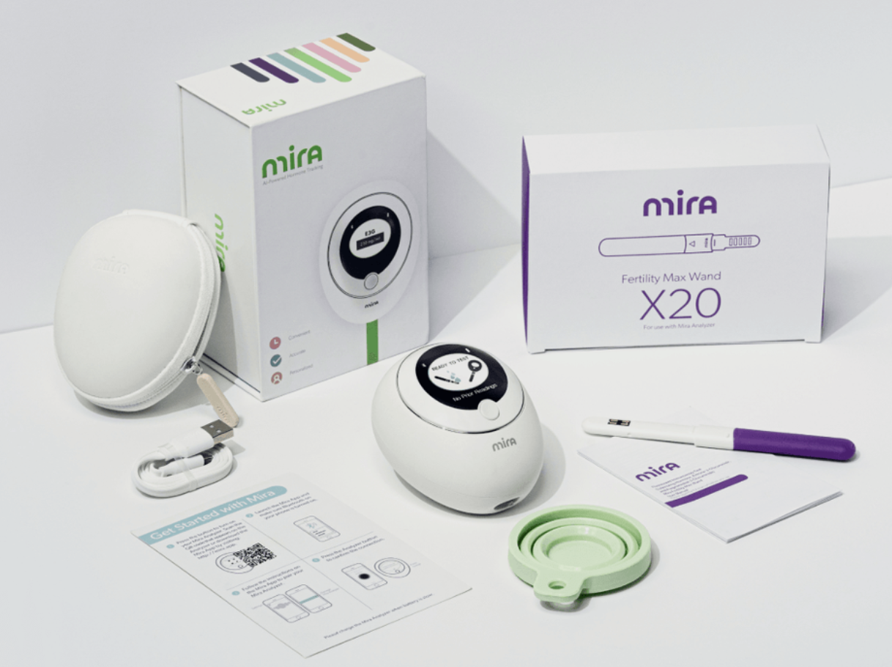
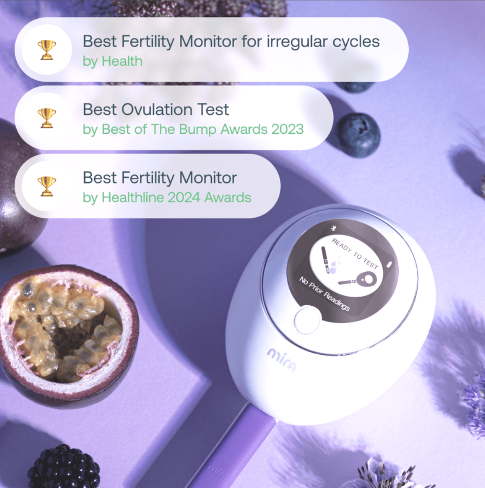
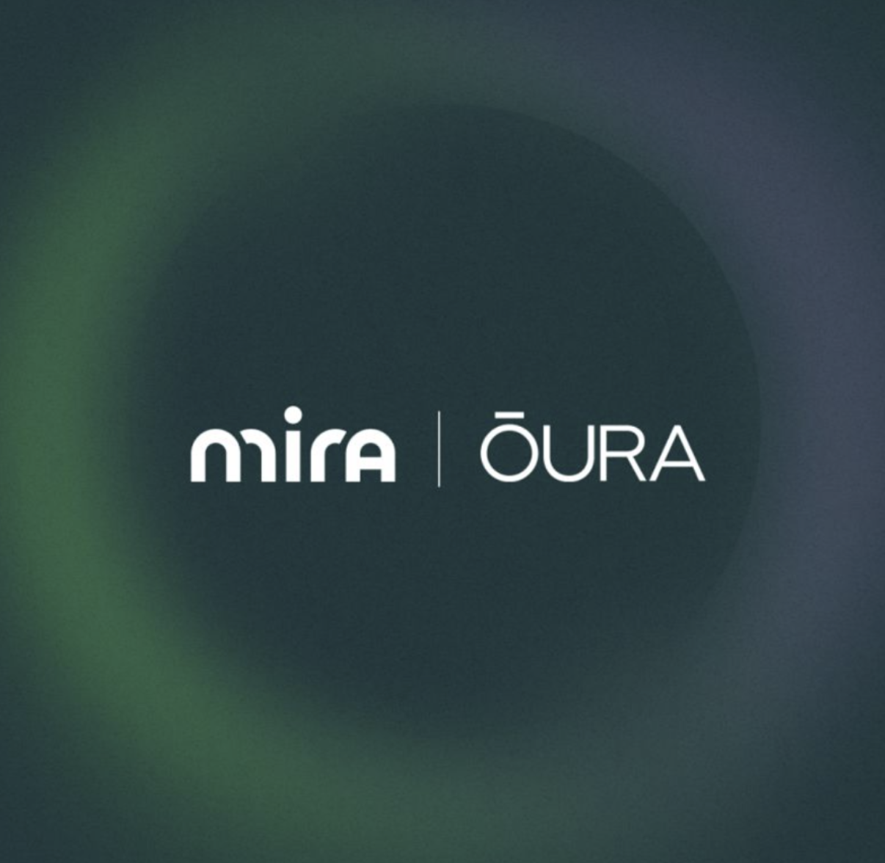

# From Piano Prodigy to the Tech Entrepreneur Who Transformed 140,000 Women's Fertility Journeys: Sylvia Kang's Cross-Disciplinary Symphony

**"Starting a business in the US is like being locked in a freezer—hard to break the ice, hard to fit in."**

Charles Zhang once said this to Yu Minhong, perfectly capturing the loneliness and alienation many Chinese entrepreneurs face abroad—an unfamiliar environment where it's difficult to be seen, heard, or understood.

But one woman from Chengdu is rewriting that narrative. Over 140,000 women across 120+ countries have used her invention—Mira—to accompany them through one of life's most intimate and emotional journeys: fertility.

Before founding Mira, Sylvia Kang had already won multiple international piano competitions. She later earned a B.S. in biomedical engineering from the University of Pittsburgh, an M.S. from Columbia University, and an MBA from Cornell University.

She spent nearly a decade at a Fortune 500 life sciences company, managing over $100 million in global business. But when she witnessed the struggles her friends faced on their fertility journeys, she realized just how broken and opaque the women's health system—especially fertility care—truly was. This harsh reality drove her to found Mira: a portable, AI-powered at-home hormone testing device that replaces blood draws with urine tests, providing women with lab-grade, personalized cycle insights.

Sylvia Kang has proven through her own experience that Chinese women entrepreneurs can create miracles, even from thousands of miles away.

{/* truncate */}

## First Movement: A Cross-Disciplinary Fantasy on Black and White Keys

"I started practicing piano at age four—it was the path my family chose for me."

Growing up in a traditional Chinese family in Chengdu, her life revolved around piano practice, recitals, and competitions. Her parents, especially her mother, had extremely high expectations, requiring five to six hours of daily practice. Her dedication paid off—she won multiple international awards and was admitted to the middle school affiliated with the Sichuan Conservatory of Music, which cultivates top musical talent.

But even as her fingers danced across the keys, her mind was drawn to a different calling. During her years at the Sichuan Conservatory, Sylvia gradually discovered an irrepressible passion for science. This passion may have been inherited from her grandfather—a pioneer of biomedical engineering in China. "He often told me about his research and inventions, and I was fascinated every time," she says. "But there were no science courses during my entire six years at the conservatory, so I decided to teach myself."

At age twelve, while her peers were immersed in practice, Sylvia was secretly studying math, chemistry, physics, and biology textbooks on her own. She was living a double life—a musical prodigy by day, a science enthusiast by night. Eventually, she made a stunning decision: to abandon 13 years of piano training and pursue her dream in biomedical engineering.

"I remember when I told my teachers and other elders that I wanted to apply to study STEM in the US, not a single person believed it was a good choice. They didn't think giving up 13 years of piano was wise, and they didn't believe I would have any advantage starting from scratch in science and engineering," she recalls.

But that's Sylvia Kang—she's not just a dreamer. She's someone who crosses boundaries between worlds, turning the impossible into reality.

## Second Movement: Variations on the Entrepreneurial Road

After six years of self-studying science, she was accepted into the University of Pittsburgh's biomedical engineering program, then completed her master's at Columbia University, followed by an MBA at Cornell. She then joined Corning Incorporated, where she rose rapidly through the ranks, becoming a business director at just 29, overseeing $100 million in global business. "Corning is a traditional American corporation with very strict promotion requirements. At that time, my peers at the same level averaged 50 years old, and 80% were white men," she says.

Around that time, many of her friends were entering their childbearing years. This is when she discovered just how incredibly difficult trying to conceive could be. "I wanted to create a product that could directly help people. There were tons of health trackers on the market, but not a single one could accurately measure women's hormonal health."

> "When I saw my friends in their 30s struggling to get pregnant and having to resort to expensive and painful assisted reproduction, I realized how chaotic, expensive, and assumption-based women's healthcare was. It was absurd! I couldn't believe that in the 21st century, there still wasn't a single tool that could help women or doctors understand hormonal health."

Long before the industry or investors took notice, Sylvia had identified the massive gap in women's health. In 2016, at-home hormone testing barely existed, and key indicators of women's health had long been overlooked. The inspiration for Mira wasn't born in a lab—it germinated from a woman's yearning for answers.

So she left her high-paying position and threw herself into startup life, entering what she calls "survival mode."

> "I was essentially building three companies at once—hardware, biological reagents, and AI software—and I knew nothing about most of the technology and certifications involved. I had to learn everything from scratch. I bought a 3D printer and started making prototypes myself."

She also faced skepticism from male investors:

> "During pitches, I had to start by explaining what luteinizing hormone was, like teaching a basic biology class. Some people had zero interest in learning, while others just gave half-hearted responses based on their wives' pregnancy experiences."

Healthcare investors preferred B2B models, while consumer investors favored subscription apps.

But she stayed committed to her DTC (direct-to-consumer) model, because her starting point was always to solve a real market gap.

She's not someone who follows trends—she's someone who predicts them.

In 2018, when AI in healthcare was still on the frontier, Sylvia made it Mira's core technology. Today, Mira's AI has analyzed over 22 million anonymous hormone data points and 850,000 cycles, advancing women's health research and providing unprecedented personalized fertility insights.

Building Mira was far from easy. Reproductive health has long been one of the least funded and most neglected areas in medicine, especially lacking real-time, personalized data support. But she persevered through it all. By 2023, Mira expanded from testing 2 hormones to 4, helping users understand conditions such as PCOS (polycystic ovary syndrome), hormonal imbalances, and ovulation issues. This upgrade not only expanded Mira's global impact but also led the conversation in the entire fertility care space, pushing AI-powered home testing to the forefront.

Just three years after launch, Mira received FDA clearance and began redefining the new chapter of women's hormonal health. Many women diagnosed with "unexplained infertility" avoided unnecessary assisted reproduction treatments, detected hormonal issues early, and truly understood their bodies for the first time.

To date, Mira has raised $6 million, achieved tens of millions in revenue, and serves over 140,000 users across 120+ countries—proof that women-friendly health tools built from women's needs are exactly what this era demands.

## Third Movement: A Concerto of Innovation

Mira isn't just an ovulation test strip—it's a clinical-grade hormone lab in your hands. Its core technology features patented fluorescence immunoassay testing and AI-powered algorithms, making it the most advanced home fertility monitor on the market.

It tests four key hormones:

- LH (Luteinizing Hormone): For precise ovulation detection
- E3G (Estrogen metabolite): For mapping the complete fertile window
- PdG (Progesterone metabolite): For confirming whether ovulation actually occurred
- FSH (Follicle-Stimulating Hormone): For assessing ovarian reserve and menopausal status

"This is the only solution that provides quantitative, personalized hormone data that doctors can actually use for clinical decisions," says Sylvia. "Although it's a home device, the data accuracy is sufficient for medical decision-making." No more vague predictions or color-changing strips—just clear, actionable results that can save women thousands of dollars and months of testing time.

Even more impressively, Mira is equipped with an AI-driven algorithm system trained on approximately 22 million hormone data points, capable of providing users with personalized predictions and recommendations. This innovative combination of lab-grade testing technology and artificial intelligence puts Mira at the industry-leading level in both accuracy and convenience.

> "During fertility treatment, the ability to test hormone levels at home can significantly reduce the burden on women. Women can conveniently and painlessly test at home, with results immediately transmitted to their doctors via the app. This also reduces the care burden on fertility clinics and the healthcare system. Overall, devices like Mira are a highly meaningful innovation that expands care accessibility and improves patient experience."

## Fourth Movement: A Concerto of Self-Management

**The hardest part of entrepreneurship isn't technological breakthroughs—it's unwavering resolve. The hardest thing isn't leading a team—it's leading yourself.**

Sylvia admits that early R&D setbacks, self-doubt, and immense pressure were the norm. But she learned to manage her mental state like tuning an instrument.

> "I ask myself: What is the root cause of this problem? What can I change? What are the priorities? Then I break it down step by step."

This mindset became her most powerful weapon. Today, Mira has over 160 employees worldwide, and its user base could fill two Bird's Nest stadiums. 84% of users successfully conceive within 6 cycles, and Mira also helps women avoid costly assisted reproduction, diagnose PCOS early, and even detect perimenopause ahead of time.

"We're not just a device—we're a companion for women at their most vulnerable moments."

## Fifth Movement: A Waltz of Global Collaboration

Under Sylvia's leadership, Mira has expanded not only its product line but also its mission—making hormone testing more accessible and widespread. As the fastest-growing FemTech company in the US, Mira launched a telehealth fertility clinic that has served thousands of women—especially those in remote areas—with virtual care. She also spearheaded the launch of Mira's menopause testing, helping women navigate perimenopause with personalized, more scientific guidance.

> "We know that fertility is affected by many factors—mental state, diet, stress, and overall well-being. Our clinic provides personalized recommendations to help users regulate their hormones and take control of their health."

Beyond products, Mira is also driving industry consensus and public awareness. In 2024, Mira launched its award-winning "Sex Hormone Awareness Campaign" and created the world's first "Sex Hormone Awareness Week," significantly elevating public discussion about hormonal health.

Sylvia understands the critical importance of scientific research and data for advancing women's health. Mira partners with leading health tech companies like Oura Ring to build women's health databases, and collaborates with institutions including Mount Sinai Hospital, Johns Hopkins University, and the University of Melbourne, along with thousands of clinicians, to study the impact of hormones, mental health, lifestyle, menstrual cycles, and menopause on career trajectories. These projects are driving policy changes and protections for women's workplace health.

> "We've truly found product-market fit and built an exceptional team. That's what has driven our steady growth."

Beyond growing Mira, she is also dedicated to raising awareness about women's health research and women's participation in STEM fields. **"I'm working hard to raise awareness about women's health as an industry—or what's called FemTech. Women are 50% of the global population, yet it's still called a niche market."**

## Finale: An Unfinished Symphony

Charles Zhang's "freezer metaphor" captures a real sense of isolation, but he left something unsaid: "The cold of a freezer cannot extinguish a burning ambition."

> "Entrepreneurship is like playing the piano—it requires skill, but even more so, it requires passion and perseverance. Most importantly, never forget why you started."

In this era of rapidly rising FemTech, Sylvia Kang and Mira inspire generation after generation of entrepreneurs—**especially Chinese women—to chase their dreams and bring Chinese innovation to the world stage.**

As Sylvia puts it:

> "The ultimate purpose of technology is to improve people's lives. It's not about how advanced it is—it's about whether it can actually be used."

From Chengdu to Silicon Valley, from the Sichuan Conservatory to Columbia and Cornell, from pianist to CEO, Sylvia Kang shows us through her actions: **Nothing in this world is impossible—there are only possibilities that haven't been pursued!**
